# Get started

The American Gut data provided by the
[`SpiecEasi`](https://github.com/zdk123/SpiecEasi) package are used for
almost all NetCoMi tutorials.

We begin by constructing a single network on genus level, which we
analyze using quantitative and graphical methods. Later, we will compare
the networks of two groups: Individuals with and without seasonal
allergies.

NetCoMi’s main functions are
[`netConstruct()`](https://netcomi.de/reference/netConstruct.md) for
network construction,
[`netAnalyze()`](https://netcomi.de/reference/netAnalyze.md) for network
analysis, and
[`netCompare()`](https://netcomi.de/reference/netCompare.md) for network
comparison. As should become clear from the following examples, these
three functions must be executed in the aforementioned order. A further
function is [`diffnet()`](https://netcomi.de/reference/diffnet.md) for
constructing a differential association network.
[`diffnet()`](https://netcomi.de/reference/diffnet.md) must be applied
to the object returned by
[`netConstruct()`](https://netcomi.de/reference/netConstruct.md).

First of all, we load NetCoMi and the data from American Gut Project
(provided by [`SpiecEasi`](https://github.com/zdk123/SpiecEasi), which
is automatically loaded together with NetCoMi).

``` r

library(NetCoMi)
library(phyloseq)

# Load data sets
data("amgut1.filt") # ASV count matrix
data("amgut2.filt.phy") # phyloseq objext
```

### Data agglomeration

*Skip this step if you wish to construct the network at ASV level*.

We start by agglomerating the phyloseq object to genus level, named
“Rank6” in this data set.

The `renameTaxa` function is used to rename the taxa according to a
defined pattern and to make the genus names unique.

``` r

# Agglomerate to genus level
amgut_genus <- tax_glom(amgut2.filt.phy, taxrank = "Rank6")

# Rename taxonomic table and make Rank6 (genus) unique
amgut_genus_renamed <- renameTaxa(amgut_genus, 
                                  pat = "<name>", 
                                  substPat = "<name>_<subst_name>(<subst_R>)",
                                  numDupli = "Rank6")
#> Column 7 contains NAs only and is ignored.
```

Let’s compare the taxa names before and after renaming them.

``` r

head(tax_table(amgut_genus))
#> Taxonomy Table:     [6 taxa by 7 taxonomic ranks]:
#>        Rank1         Rank2               Rank3                      
#> 181016 "k__Bacteria" "p__Firmicutes"     "c__Clostridia"            
#> 191687 "k__Bacteria" "p__Firmicutes"     "c__Clostridia"            
#> 305760 "k__Bacteria" "p__Proteobacteria" "c__Gammaproteobacteria"   
#> 326977 "k__Bacteria" "p__Actinobacteria" "c__Actinobacteria (class)"
#> 28186  "k__Bacteria" "p__Firmicutes"     "c__Bacilli"               
#> 541301 "k__Bacteria" "p__Bacteroidetes"  "c__Bacteroidia"           
#>        Rank4                  Rank5                   Rank6               
#> 181016 "o__Clostridiales"     "f__Ruminococcaceae"    "g__Eubacterium"    
#> 191687 "o__Clostridiales"     "f__Lachnospiraceae"    "g__Clostridium"    
#> 305760 "o__Enterobacteriales" "f__Enterobacteriaceae" "g__Escherichia"    
#> 326977 "o__Bifidobacteriales" "f__Bifidobacteriaceae" "g__Bifidobacterium"
#> 28186  "o__Lactobacillales"   "f__Enterococcaceae"    "g__Enterococcus"   
#> 541301 "o__Bacteroidales"     "f__Porphyromonadaceae" "g__Parabacteroides"
#>        Rank7
#> 181016 NA   
#> 191687 NA   
#> 305760 NA   
#> 326977 NA   
#> 28186  NA   
#> 541301 NA
head(tax_table(amgut_genus_renamed))
#> Taxonomy Table:     [6 taxa by 7 taxonomic ranks]:
#>        Rank1      Rank2            Rank3                    Rank4              
#> 181016 "Bacteria" "Firmicutes"     "Clostridia"             "Clostridiales"    
#> 191687 "Bacteria" "Firmicutes"     "Clostridia"             "Clostridiales"    
#> 305760 "Bacteria" "Proteobacteria" "Gammaproteobacteria"    "Enterobacteriales"
#> 326977 "Bacteria" "Actinobacteria" "Actinobacteria (class)" "Bifidobacteriales"
#> 28186  "Bacteria" "Firmicutes"     "Bacilli"                "Lactobacillales"  
#> 541301 "Bacteria" "Bacteroidetes"  "Bacteroidia"            "Bacteroidales"    
#>        Rank5                Rank6             Rank7
#> 181016 "Ruminococcaceae"    "Eubacterium1"    NA   
#> 191687 "Lachnospiraceae"    "Clostridium1"    NA   
#> 305760 "Enterobacteriaceae" "Escherichia"     NA   
#> 326977 "Bifidobacteriaceae" "Bifidobacterium" NA   
#> 28186  "Enterococcaceae"    "Enterococcus"    NA   
#> 541301 "Porphyromonadaceae" "Parabacteroides" NA
```

``` r

taxtab <- tax_table(amgut_genus)
taxtab[taxtab[, "Rank6"] == "g__Eubacterium", ]
#> Taxonomy Table:     [2 taxa by 7 taxonomic ranks]:
#>        Rank1         Rank2           Rank3           Rank4             
#> 181016 "k__Bacteria" "p__Firmicutes" "c__Clostridia" "o__Clostridiales"
#> 189396 "k__Bacteria" "p__Firmicutes" "c__Clostridia" "o__Clostridiales"
#>        Rank5                Rank6            Rank7
#> 181016 "f__Ruminococcaceae" "g__Eubacterium" NA   
#> 189396 "f__Lachnospiraceae" "g__Eubacterium" NA
```

For example, a “1” has been added to Eubacterium because this genus
exists twice: once in the Ruminococcaceae family and once in the
Lachnospiraceae family. For association estimation, it is important to
distinguish between them, so they are numbered.

### Network construction

We use the [SPRING](https://github.com/GraceYoon/SPRING) package for
estimating associations (conditional dependence) between taxa.

The data are filtered within
[`netConstruct()`](https://netcomi.de/reference/netConstruct.md) as
follows:

- Only samples with a total number of reads of at least 1000 are
  included (argument `filtSamp`).
- Only the 50 taxa with highest frequency are included (argument
  `filtTax`).

Note that the taxa filter is set for demonstration purposes only, but
has no effect here because there are only 43 genera in the data set.

`measure` defines the association or dissimilarity measure, which is
`"spring"` in our case. Additional arguments are passed to
[`SPRING()`](https://rdrr.io/pkg/SPRING/man/SPRING.html) via
`measurePar`. `nlambda` and `rep.num` are set to 10 for a decreased
execution time, but should be higher for real data. `Rmethod` is set to
“approx” to estimate the correlations using a hybrid multi-linear
interpolation approach proposed by @yoon2020fast. This method
considerably reduces the runtime while controlling the approximation
error.

Normalization as well as zero handling is performed internally in
[`SPRING()`](https://rdrr.io/pkg/SPRING/man/SPRING.html). Hence, we set
`normMethod` and `zeroMethod` to `"none"`.

We furthermore set `sparsMethod` to `"none"` because `SPRING` returns a
sparse network where no additional sparsification step is necessary.

We use the “signed” method for transforming associations into
dissimilarities (argument `dissFunc`). In doing so, strongly negatively
associated taxa have a high dissimilarity and, in turn, a low
similarity, which corresponds to edge weights in the network plot.

The `verbose` argument is set to 3 so that all messages generated by
[`netConstruct()`](https://netcomi.de/reference/netConstruct.md) as well
as messages of external functions are printed.

``` r

net_spring <- netConstruct(amgut_genus_renamed,
                           taxRank = "Rank6",
                           filtTax = "highestFreq",
                           filtTaxPar = list(highestFreq = 50),
                           filtSamp = "totalReads",
                           filtSampPar = list(totalReads = 1000),
                           measure = "spring",
                           measurePar = list(nlambda=10, 
                                             rep.num=10,
                                             Rmethod = "approx"),
                           normMethod = "none", 
                           zeroMethod = "none",
                           sparsMethod = "none", 
                           dissFunc = "signed",
                           verbose = 2,
                           seed = 123456)
#> Checking input arguments ... Done.
#> Data filtering ...
#> 35 samples removed.
#> 43 taxa and 261 samples remaining.
#> 
#> Calculate 'spring' associations ... Done.
```

Let’s take a look at the edge list, which contains for each pair of
nodes the estimated association, the dissimilarity and the adjacency (=
edge weight for weighted networks).

``` r

head(net_spring$edgelist1)
#>             v1           v2         asso      diss      adja
#> 1 Eubacterium1        Dorea  0.003889757 0.7057302 0.2942698
#> 2 Eubacterium1      Pantoea -0.014903239 0.7123564 0.2876436
#> 3 Clostridium1 Eubacterium2  0.096448655 0.6721426 0.3278574
#> 4 Clostridium1   Raoultella -0.012676413 0.7115745 0.2884255
#> 5 Clostridium1        Dorea  0.015724182 0.7015254 0.2984746
#> 6 Clostridium1      Cedecea -0.003375699 0.7082993 0.2917007
```

We can also use NetCoMi’s `plotHeat` function to plot the estimated
associations.

``` r

plotHeat(net_spring$assoMat1, textUpp = "none", textLow = "none")
```

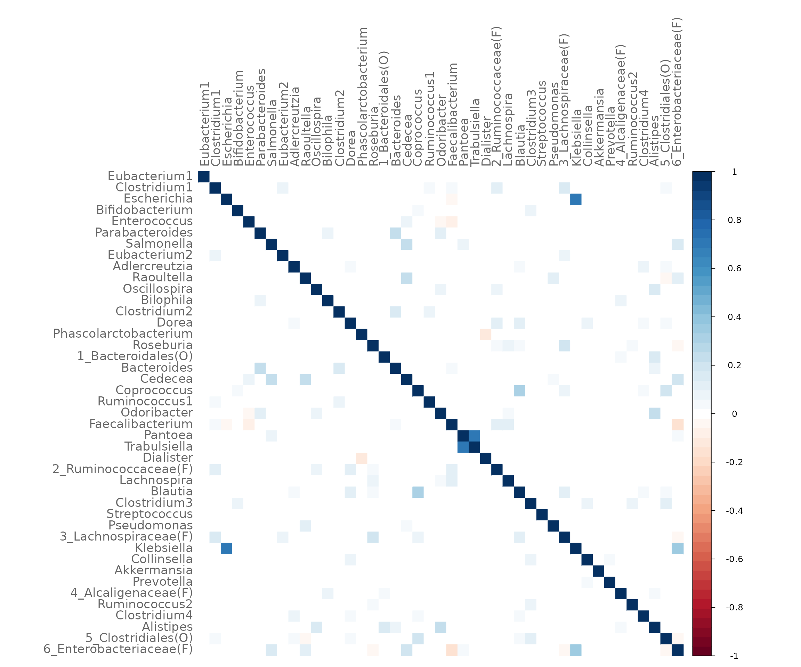

### Network analysis

NetCoMi’s [`netAnalyze()`](https://netcomi.de/reference/netAnalyze.md)
function is used for analyzing the constructed network.

Here, `centrLCC` is set to `TRUE` meaning that centralities are
calculated only for nodes in the largest connected component (LCC).

Clusters are identified using greedy modularity optimization (by
`cluster_fast_greedy()` from [`igraph`](https://igraph.org/r/) package).

Hubs are nodes with an eigenvector centrality value above the empirical
95% quantile of all eigenvector centralities in the network (argument
`hubPar`).

`weightDeg` and `normDeg` are set to `FALSE` so that the degree of a
node is simply defined as number of nodes that are adjacent to the node.

By default, a heatmap of the Graphlet Correlation Matrix (GCM) is
returned (with graphlet correlations in the upper triangle and
significance codes resulting from Student’s t-test in the lower
triangle). See [`?calcGCM`](https://netcomi.de/reference/calcGCM.md) and
[`?testGCM`](https://netcomi.de/reference/testGCM.md) for details.

``` r

props_spring <- netAnalyze(net_spring, 
                           centrLCC = TRUE,
                           clustMethod = "cluster_fast_greedy",
                           hubPar = "eigenvector",
                           weightDeg = FALSE, 
                           normDeg = FALSE)
```

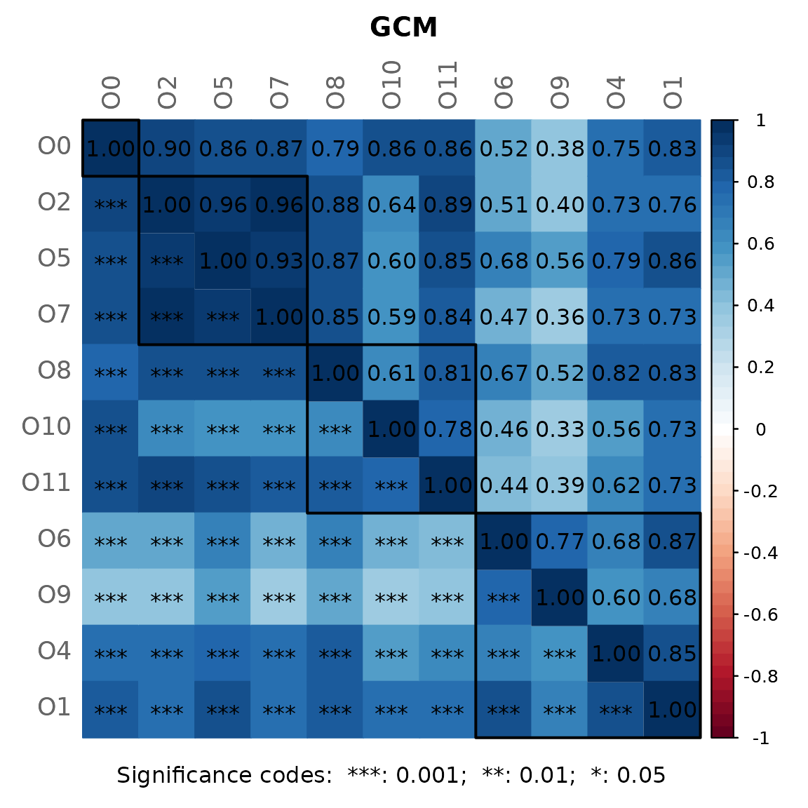

``` r


#?summary.microNetProps
summary(props_spring, numbNodes = 5L)
```

    #> 
    #> Component sizes
    #> ```````````````            
    #> size: 40 2 1
    #>    #:  1 1 1
    #> ______________________________
    #> Global network properties
    #> `````````````````````````
    #> Largest connected component (LCC):
    #>                                  
    #> Relative LCC size         0.93023
    #> Clustering coefficient    0.30444
    #> Modularity                0.44962
    #> Positive edge percentage 83.65385
    #> Edge density              0.13333
    #> Natural connectivity      0.03658
    #> Vertex connectivity       1.00000
    #> Edge connectivity         1.00000
    #> Average dissimilarity*    0.95727
    #> Average path length**     1.84697
    #> 
    #> Whole network:
    #>                                  
    #> Number of components      3.00000
    #> Clustering coefficient    0.30444
    #> Modularity                0.45572
    #> Positive edge percentage 82.85714
    #> Edge density              0.11628
    #> Natural connectivity      0.03337
    #> -----
    #> *: Dissimilarity = 1 - edge weight
    #> **: Path length = Units with average dissimilarity
    #> 
    #> ______________________________
    #> Clusters
    #> - In the whole network
    #> - Algorithm: cluster_fast_greedy
    #> ```````````````````````````````` 
    #>                     
    #> name: 0  1  2  3 4 5
    #>    #: 1 11 10 12 2 7
    #> 
    #> ______________________________
    #> Hubs
    #> - In alphabetical/numerical order
    #> - Based on empirical quantiles of centralities
    #> ```````````````````````````````````````````````                        
    #>  5_Clostridiales(O)     
    #>  6_Enterobacteriaceae(F)
    #>  Clostridium1           
    #> 
    #> ______________________________
    #> Centrality measures
    #> - In decreasing order
    #> - Centrality of disconnected components is zero
    #> ````````````````````````````````````````````````
    #> Degree (unnormalized):
    #>                           
    #> Dorea                   11
    #> 6_Enterobacteriaceae(F) 11
    #> Clostridium1            10
    #> Raoultella              10
    #> 5_Clostridiales(O)      10
    #> 
    #> Betweenness centrality (normalized):
    #>                             
    #> Dorea                0.17139
    #> 2_Ruminococcaceae(F) 0.16194
    #> Odoribacter          0.13900
    #> Faecalibacterium     0.12146
    #> 5_Clostridiales(O)   0.12146
    #> 
    #> Closeness centrality (normalized):
    #>                                
    #> Clostridium1            0.82689
    #> 5_Clostridiales(O)      0.81840
    #> 6_Enterobacteriaceae(F) 0.81262
    #> Dorea                   0.80538
    #> Faecalibacterium        0.80050
    #> 
    #> Eigenvector centrality (normalized):
    #>                                
    #> Clostridium1            1.00000
    #> 6_Enterobacteriaceae(F) 0.94259
    #> 5_Clostridiales(O)      0.92116
    #> Dorea                   0.89785
    #> 3_Lachnospiraceae(F)    0.83890

### Visualizing the network

We use the determined clusters as node colors and scale the node sizes
according to the node’s eigenvector centrality.

``` r

# help page
?plot.microNetProps
```

``` r

p <- plot(props_spring, 
          labelScale = FALSE,
          nodeColor = "cluster", 
          nodeSize = "eigenvector",
          title1 = "Network on genus level with SPRING associations", 
          showTitle = TRUE,
          cexTitle = 2.3,
          cexLabels = 1.5)

legend(0.7, 1.1, cex = 2.2, title = "estimated association:",
       legend = c("+","-"), lty = 1, lwd = 3, col = c("#009900","red"), 
       bty = "n", horiz = TRUE)
```

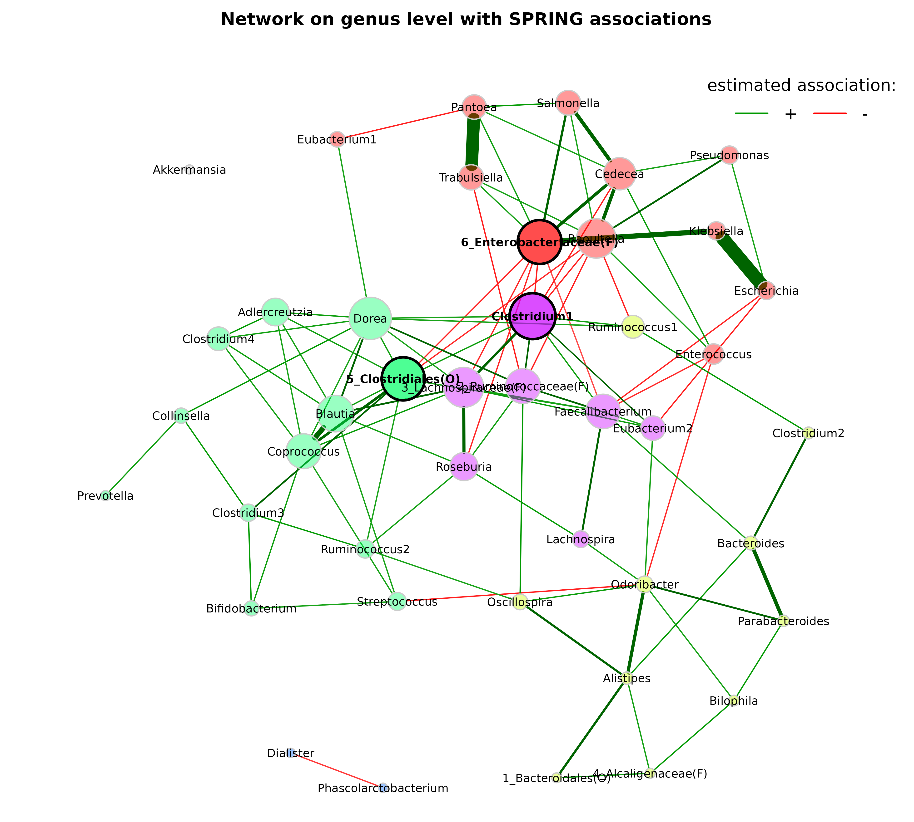

Note that edge weights are (non-negative) similarities, however, the
edges belonging to negative estimated associations are colored in red by
default (`negDiffCol = TRUE`).

By default, a different transparency value is added to edges with an
absolute weight below and above the `cut` value (arguments
`edgeTranspLow` and `edgeTranspHigh`). The determined `cut` value can be
read out as follows:

``` r

p$q1$Arguments$cut
#>       75% 
#> 0.3278574
```

### Export to Gephi

Some users may be interested in how to export the network to Gephi.
Here’s an example:

``` r

# For Gephi, we have to generate an edge list with IDs.
# The corresponding labels (and also further node features) are stored as node list.

# Create edge object from the edge list exported by netConstruct()
edges <- dplyr::select(net_spring$edgelist1, v1, v2)

# Add Source and Target variables (as IDs)
edges$Source <- as.numeric(factor(edges$v1))
edges$Target <- as.numeric(factor(edges$v2))
edges$Type <- "Undirected"
edges$Weight <- net_spring$edgelist1$adja

nodes <- unique(edges[,c('v1','Source')])
colnames(nodes) <- c("Label", "Id")

# Add category with clusters (can be used as node colors in Gephi)
nodes$Category <- props_spring$clustering$clust1[nodes$Label]

edges <- dplyr::select(edges, Source, Target, Type, Weight)

write.csv(nodes, file = "nodes.csv", row.names = FALSE)
write.csv(edges, file = "edges.csv", row.names = FALSE)
```

The exported .csv files can then be imported into Gephi.

------------------------------------------------------------------------

### Network with Pearson correlation as association measure

Let’s construct another network using Pearson’s correlation coefficient
as association measure. The input is now a `phyloseq` object.

Since Pearson correlations may lead to compositional effects when
applied to sequencing data, we use the clr transformation as
normalization method. Zero treatment is necessary in this case.

A threshold of 0.3 is used as sparsification method, so that only OTUs
with an absolute correlation greater than or equal to 0.3 are connected.

``` r

net_pears <- netConstruct(amgut2.filt.phy,  
                          measure = "pearson",
                          normMethod = "clr",
                          zeroMethod = "multRepl",
                          sparsMethod = "threshold",
                          thresh = 0.3,
                          verbose = 3)
#> Checking input arguments ... Done.
#> 2 rows with zero sum removed.
#> 138 taxa and 294 samples remaining.
#> 
#> Zero treatment:
#> Execute multRepl() ... Done.
#> 
#> Normalization:
#> Execute clr(){SpiecEasi} ... Done.
#> 
#> Calculate 'pearson' associations ... Done.
#> 
#> Sparsify associations via 'threshold' ... Done.
```

Network analysis and plotting:

``` r

props_pears <- netAnalyze(net_pears, 
                          clustMethod = "cluster_fast_greedy")
```

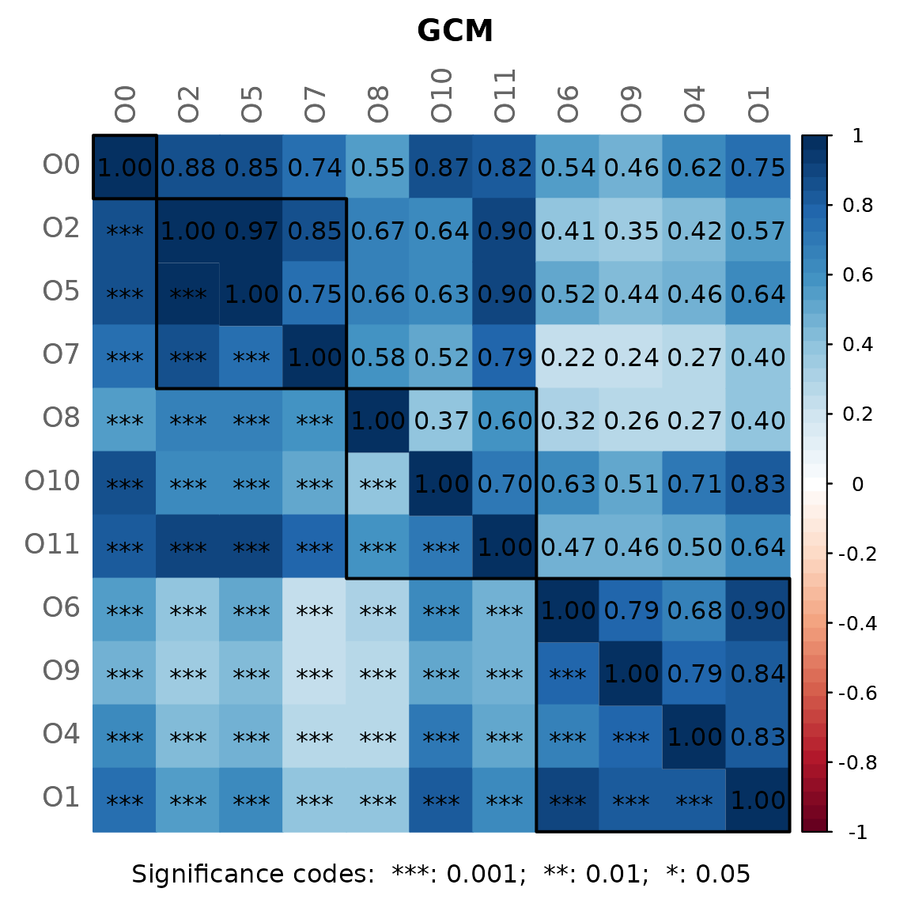

``` r

plot(props_pears, 
     nodeColor = "cluster", 
     nodeSize = "eigenvector",
     title1 = "Network on OTU level with Pearson correlations", 
     showTitle = TRUE,
     cexTitle = 2.3)

legend(0.7, 1.1, cex = 2.2, title = "estimated correlation:", 
       legend = c("+","-"), lty = 1, lwd = 3, col = c("#009900","red"), 
       bty = "n", horiz = TRUE)
```

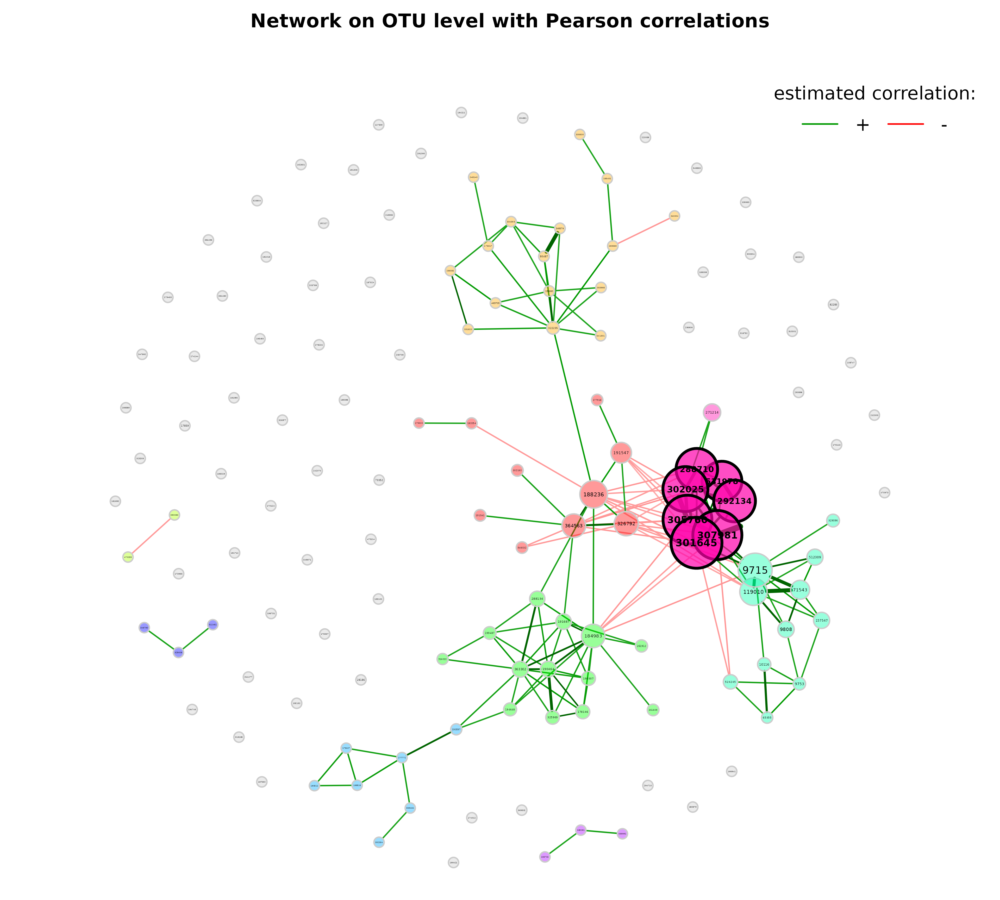

Let’s improve the visualization by changing the following arguments:

- `repulsion = 0.8`: Place the nodes further apart.
- `rmSingles = TRUE`: Single nodes are removed.
- `labelScale = FALSE` and `cexLabels = 1.6`: All labels have equal size
  and are enlarged to improve readability of small node’s labels.
- `nodeSizeSpread = 3` (default is 4): Node sizes are more similar if
  the value is decreased. This argument (in combination with `cexNodes`)
  is useful to enlarge small nodes while keeping the size of big nodes.
- `hubBorderCol = "darkgray"`: Change border color for a better
  readability of the node labels.

``` r

plot(props_pears, 
     nodeColor = "cluster", 
     nodeSize = "eigenvector",
     repulsion = 0.8,
     rmSingles = TRUE,
     labelScale = FALSE,
     cexLabels = 1.6,
     nodeSizeSpread = 3,
     cexNodes = 2,
     hubBorderCol = "darkgray",
     title1 = "Network on OTU level with Pearson correlations", 
     showTitle = TRUE,
     cexTitle = 2.3)

legend(0.7, 1.1, cex = 2.2, title = "estimated correlation:",
       legend = c("+","-"), lty = 1, lwd = 3, col = c("#009900","red"),
       bty = "n", horiz = TRUE)
```

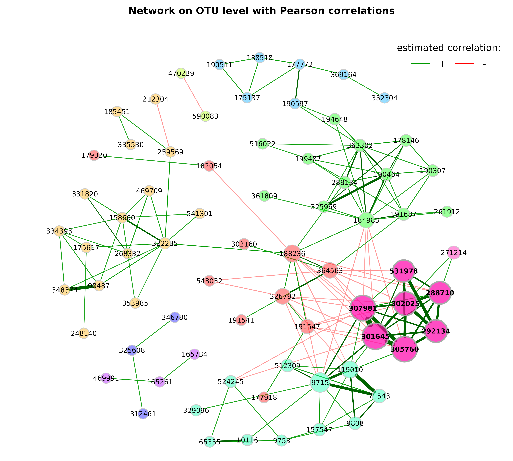

#### Edge filtering

The network can be sparsified further using the arguments `edgeFilter`
(edges are filtered before the layout is computed) and `edgeInvisFilter`
(edges are removed after the layout is computed and thus just made
“invisible”).

``` r

plot(props_pears,
     edgeInvisFilter = "threshold",
     edgeInvisPar = 0.4,
     nodeColor = "cluster", 
     nodeSize = "eigenvector",
     repulsion = 0.8,
     rmSingles = TRUE,
     labelScale = FALSE,
     cexLabels = 1.6,
     nodeSizeSpread = 3,
     cexNodes = 2,
     hubBorderCol = "darkgray",
     title1 = paste0("Network on OTU level with Pearson correlations",
                     "\n(edge filter: threshold = 0.4)"),
     showTitle = TRUE,
     cexTitle = 2.3)

legend(0.7, 1.1, cex = 2.2, title = "estimated correlation:",
       legend = c("+","-"), lty = 1, lwd = 3, col = c("#009900","red"),
       bty = "n", horiz = TRUE)
```

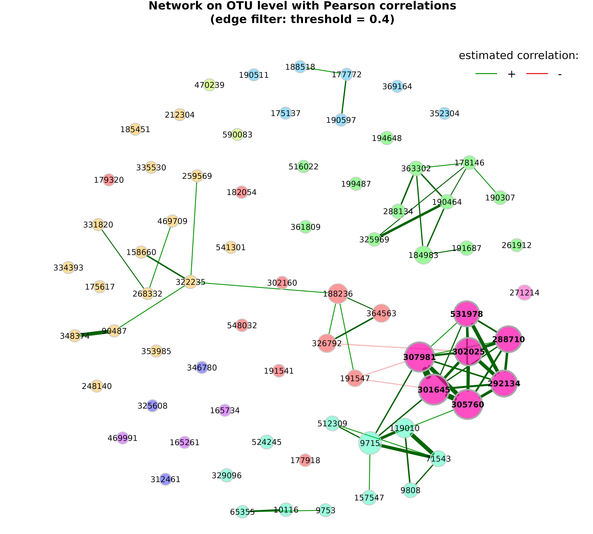

------------------------------------------------------------------------

### Using the “unsigned” transformation

In the above network, the “signed” transformation was used to transform
the estimated associations into dissimilarities. This leads to a network
where strongly positive correlated taxa have a high edge weight (1 if
the correlation equals 1) and strongly negative correlated taxa have a
low edge weight (0 if the correlation equals -1).

We now use the “unsigned” transformation so that the edge weight between
strongly correlated taxa is high, no matter of the sign. Hence, a
correlation of -1 and 1 would lead to an edge weight of 1.

#### Network construction

We can pass the network object from before to
[`netConstruct()`](https://netcomi.de/reference/netConstruct.md) to save
runtime.

``` r

net_pears_unsigned <- netConstruct(data = net_pears$assoEst1,
                                   dataType = "correlation", 
                                   sparsMethod = "threshold",
                                   thresh = 0.3,
                                   dissFunc = "unsigned",
                                   verbose = 3)
#> Checking input arguments ... Done.
#> 
#> Sparsify associations via 'threshold' ... Done.
```

#### Estimated correlations and adjacency values

The following histograms demonstrate how the estimated correlations are
transformed into adjacencies (= sparsified similarities for weighted
networks).

Sparsified estimated correlations:

``` r

hist(net_pears$assoMat1, 100, xlim = c(-1, 1), ylim = c(0, 400),
     xlab = "Estimated correlation", 
     main = "Estimated correlations after sparsification")
```

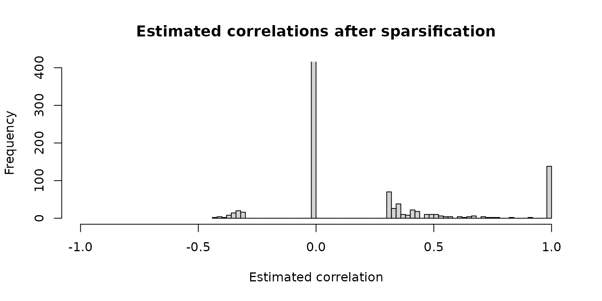

Adjacency values computed using the “signed” transformation (values
different from 0 and 1 will be edges in the network):

``` r

hist(net_pears$adjaMat1, 100, ylim = c(0, 400),
     xlab = "Adjacency values", 
     main = "Adjacencies (with \"signed\" transformation)")
```

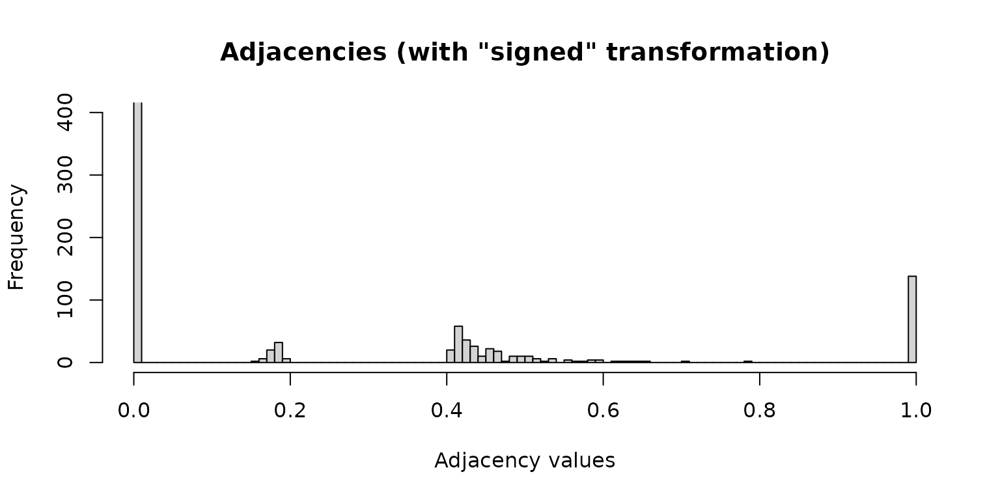

Adjacency values computed using the “unsigned” transformation:

``` r

hist(net_pears_unsigned$adjaMat1, 100, ylim = c(0, 400),
     xlab = "Adjacency values", 
     main = "Adjacencies (with \"unsigned\" transformation)")
```

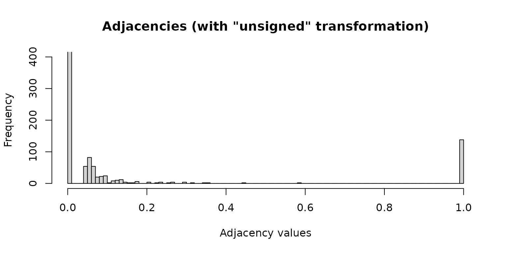

#### Network analysis and plotting

``` r

props_pears_unsigned <- netAnalyze(net_pears_unsigned, 
                                   clustMethod = "cluster_fast_greedy",
                                   gcmHeat = FALSE)
```

``` r

plot(props_pears_unsigned, 
     nodeColor = "cluster", 
     nodeSize = "eigenvector",
     repulsion = 0.9,
     rmSingles = TRUE,
     labelScale = FALSE,
     cexLabels = 1.6,
     nodeSizeSpread = 3,
     cexNodes = 2,
     hubBorderCol = "darkgray",
     title1 = "Network with Pearson correlations and \"unsigned\" transformation", 
     showTitle = TRUE,
     cexTitle = 2.3)

legend(0.7, 1.1, cex = 2.2, title = "estimated correlation:",
       legend = c("+","-"), lty = 1, lwd = 3, col = c("#009900","red"),
       bty = "n", horiz = TRUE)
```

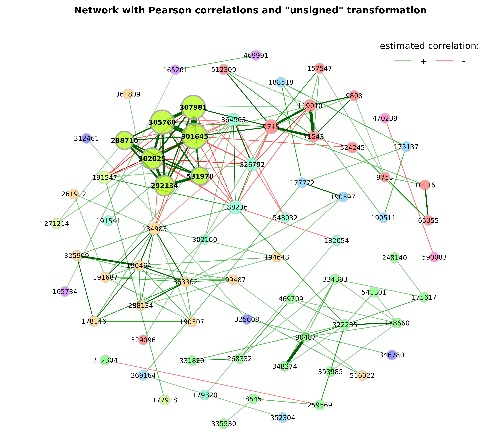

While with the “signed” transformation, positive correlated taxa are
likely to belong to the same cluster, with the “unsigned” transformation
clusters contain strongly positive and negative correlated taxa.

------------------------------------------------------------------------

### Network on genus level

We now construct a further network, where OTUs are agglomerated to
genera.

``` r

library(phyloseq)
data("amgut2.filt.phy")

# Agglomerate to genus level
amgut_genus <- tax_glom(amgut2.filt.phy, taxrank = "Rank6")

# Taxonomic table
taxtab <- as(tax_table(amgut_genus), "matrix")

# Rename taxonomic table and make Rank6 (genus) unique
amgut_genus_renamed <- renameTaxa(amgut_genus, 
                                  pat = "<name>", 
                                  substPat = "<name>_<subst_name>(<subst_R>)",
                                  numDupli = "Rank6")
#> Column 7 contains NAs only and is ignored.

# Network construction and analysis
net_genus <- netConstruct(amgut_genus_renamed,
                          taxRank = "Rank6",
                          measure = "pearson",
                          zeroMethod = "multRepl",
                          normMethod = "clr",
                          sparsMethod = "threshold",
                          thresh = 0.3,
                          verbose = 3)
#> Checking input arguments ...
#> Done.
#> 2 rows with zero sum removed.
#> 43 taxa and 294 samples remaining.
#> 
#> Zero treatment:
#> Execute multRepl() ... Done.
#> 
#> Normalization:
#> Execute clr(){SpiecEasi} ... Done.
#> 
#> Calculate 'pearson' associations ... Done.
#> 
#> Sparsify associations via 'threshold' ... Done.

props_genus <- netAnalyze(net_genus, clustMethod = "cluster_fast_greedy")
```

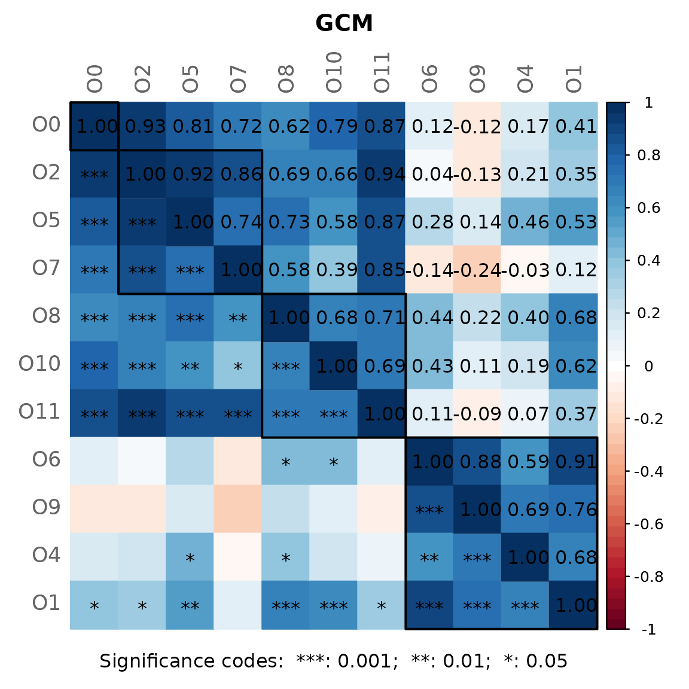

#### Network plots

Modifications:

- Fruchterman-Reingold layout algorithm from `igraph` package used
  (passed to `plot` as matrix)
- Shortened labels (using the “intelligent” method, which avoids
  duplicates)
- Fixed node sizes, where hubs are enlarged
- Node color is gray for all nodes (transparancy is lower for hub nodes
  by default)

``` r

# Compute layout
graph3 <- igraph::graph_from_adjacency_matrix(net_genus$adjaMat1, 
                                              weighted = TRUE)
set.seed(123456)
lay_fr <- igraph::layout_with_fr(graph3)

# Row names of the layout matrix must match the node names
rownames(lay_fr) <- rownames(net_genus$adjaMat1)

plot(props_genus,
     layout = lay_fr,
     shortenLabels = "intelligent",
     labelLength = 10,
     labelPattern = c(5, "'", 3, "'", 3),
     nodeSize = "fix",
     nodeColor = "gray",
     cexNodes = 0.8,
     cexHubs = 1.1,
     cexLabels = 1.2,
     title1 = "Network on genus level with Pearson correlations", 
     showTitle = TRUE,
     cexTitle = 2.3)

legend(0.7, 1.1, cex = 2.2, title = "estimated correlation:",
       legend = c("+","-"), lty = 1, lwd = 3, col = c("#009900","red"), 
       bty = "n", horiz = TRUE)
```

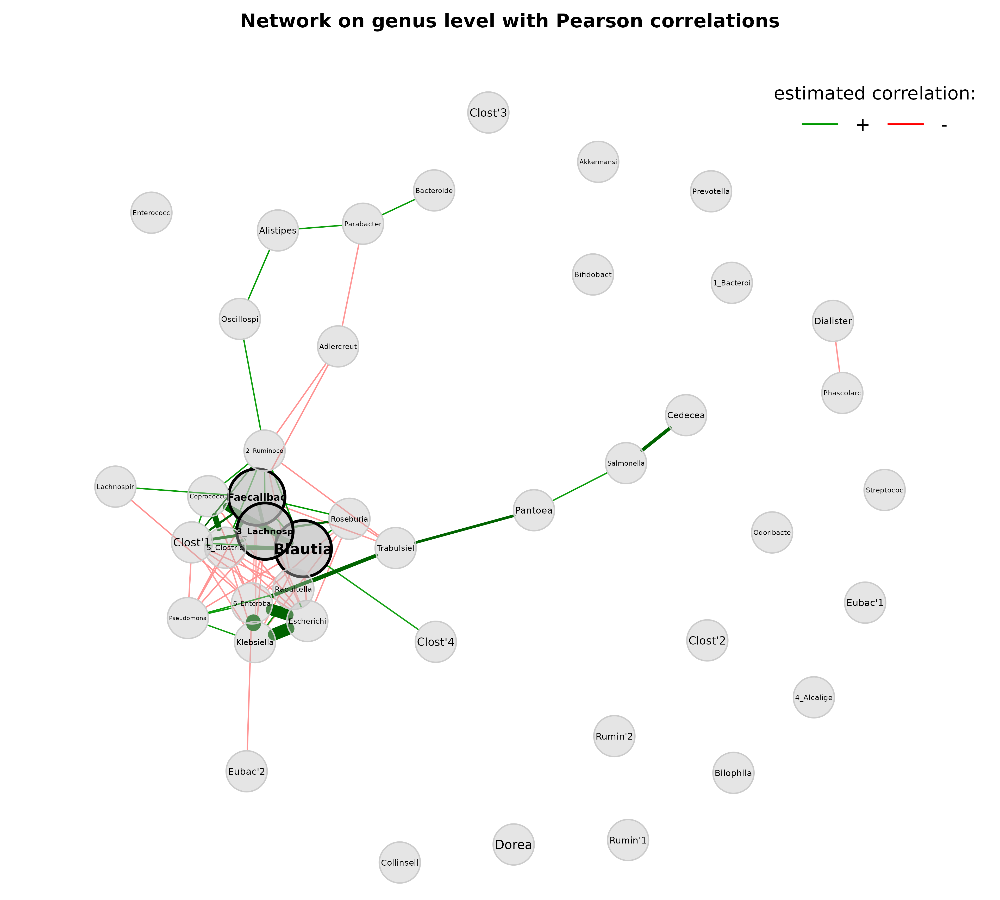

Since the above visualization is obviously not optimal, we make further
adjustments:

- This time, the Fruchterman-Reingold layout algorithm is computed
  within the plot function and thus applied to the “reduced” network
  without singletons
- Labels are not scaled to node sizes
- Single nodes are removed
- Node sizes are scaled to the column sums of clr-transformed data
- Node colors represent the determined clusters
- Border color of hub nodes is changed from black to darkgray
- Label size of hubs is enlarged

``` r

set.seed(123456)

plot(props_genus,
     layout = "layout_with_fr",
     shortenLabels = "intelligent",
     labelLength = 10,
     labelPattern = c(5, "'", 3, "'", 3),
     labelScale = FALSE,
     rmSingles = TRUE,
     nodeSize = "clr",
     nodeColor = "cluster",
     hubBorderCol = "darkgray",
     cexNodes = 2,
     cexLabels = 1.5,
     cexHubLabels = 2,
     title1 = "Network on genus level with Pearson correlations", 
     showTitle = TRUE,
     cexTitle = 2.3)

legend(0.7, 1.1, cex = 2.2, title = "estimated correlation:",
       legend = c("+","-"), lty = 1, lwd = 3, col = c("#009900","red"), 
       bty = "n", horiz = TRUE)
```

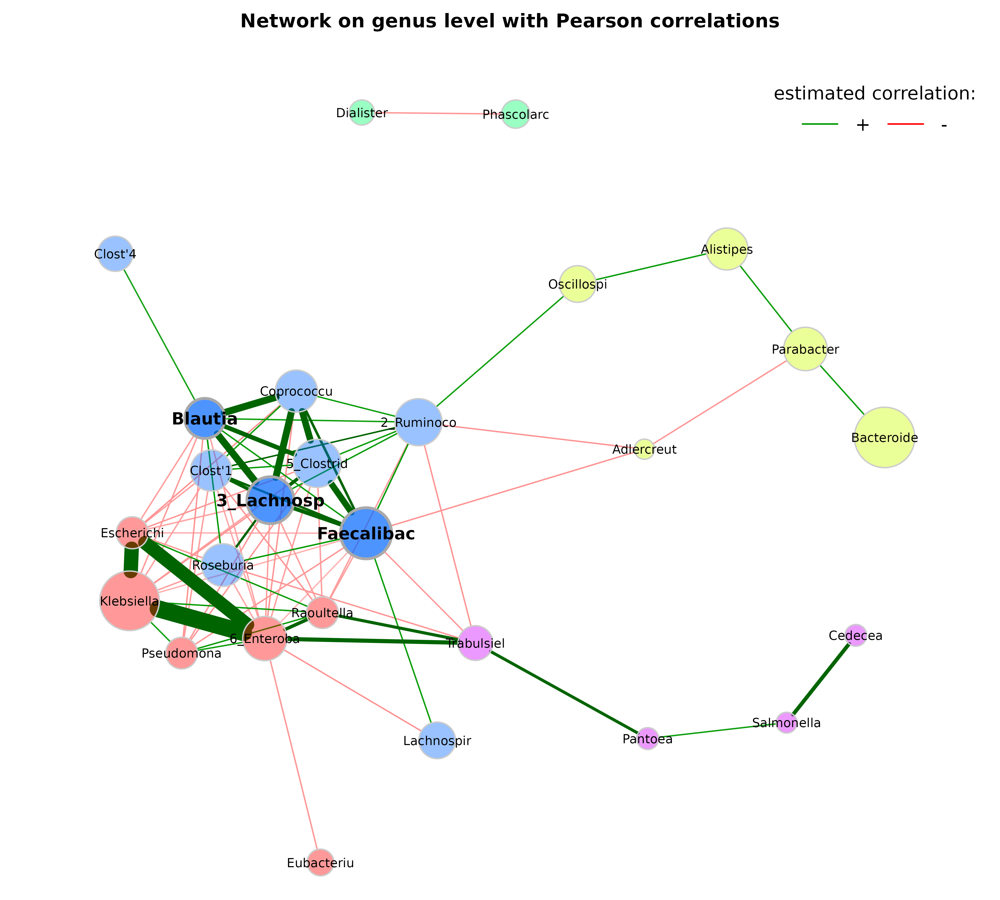

Let’s check whether the largest nodes are actually those with highest
column sums in the matrix with normalized counts returned by
[`netConstruct()`](https://netcomi.de/reference/netConstruct.md).

``` r

sort(colSums(net_genus$normCounts1), decreasing = TRUE)[1:10]
#>             Bacteroides              Klebsiella        Faecalibacterium 
#>               1200.7971               1137.4928                708.0877 
#>      5_Clostridiales(O)    2_Ruminococcaceae(F)    3_Lachnospiraceae(F) 
#>                549.2647                502.1889                493.7558 
#> 6_Enterobacteriaceae(F)               Roseburia         Parabacteroides 
#>                363.3841                333.8737                328.0495 
#>             Coprococcus 
#>                274.4082
```

In order to further improve our plot, we use the following
modifications:

- This time, we choose the “spring” layout as part of `qgraph()` (the
  function is generally used for network plotting in NetCoMi)
- A repulsion value below 1 places the nodes further apart
- Labels are not shortened anymore
- Nodes (bacteria on genus level) are colored according to the
  respective phylum
- Edges representing positive associations are colored in blue, negative
  ones in orange (just to give an example for alternative edge coloring)
- Transparency is increased for edges with high weight to improve the
  readability of node labels

``` r

# Get phyla names
taxtab <- as(tax_table(amgut_genus_renamed), "matrix")
phyla <- as.factor(gsub("p__", "", taxtab[, "Rank2"]))
names(phyla) <- taxtab[, "Rank6"]
#table(phyla)

# Define phylum colors
phylcol <- c("cyan", "blue3", "red", "lawngreen", "yellow", "deeppink")

plot(props_genus,
     layout = "spring",
     repulsion = 0.84,
     shortenLabels = "none",
     charToRm = "g__",
     labelScale = FALSE,
     rmSingles = TRUE,
     nodeSize = "clr",
     nodeSizeSpread = 4,
     nodeColor = "feature", 
     featVecCol = phyla, 
     colorVec =  phylcol,
     posCol = "darkturquoise", 
     negCol = "orange",
     edgeTranspLow = 0,
     edgeTranspHigh = 40,
     cexNodes = 2,
     cexLabels = 2,
     cexHubLabels = 2.5,
     title1 = "Network on genus level with Pearson correlations", 
     showTitle = TRUE,
     cexTitle = 2.3)

# Colors used in the legend should be equally transparent as in the plot
phylcol_transp <- colToTransp(phylcol, 60)

legend(-1.2, 1.2, cex = 2, pt.cex = 2.5, title = "Phylum:", 
       legend=levels(phyla), col = phylcol_transp, bty = "n", pch = 16) 

legend(0.7, 1.1, cex = 2.2, title = "estimated correlation:",
       legend = c("+","-"), lty = 1, lwd = 3, col = c("darkturquoise","orange"), 
       bty = "n", horiz = TRUE)
```

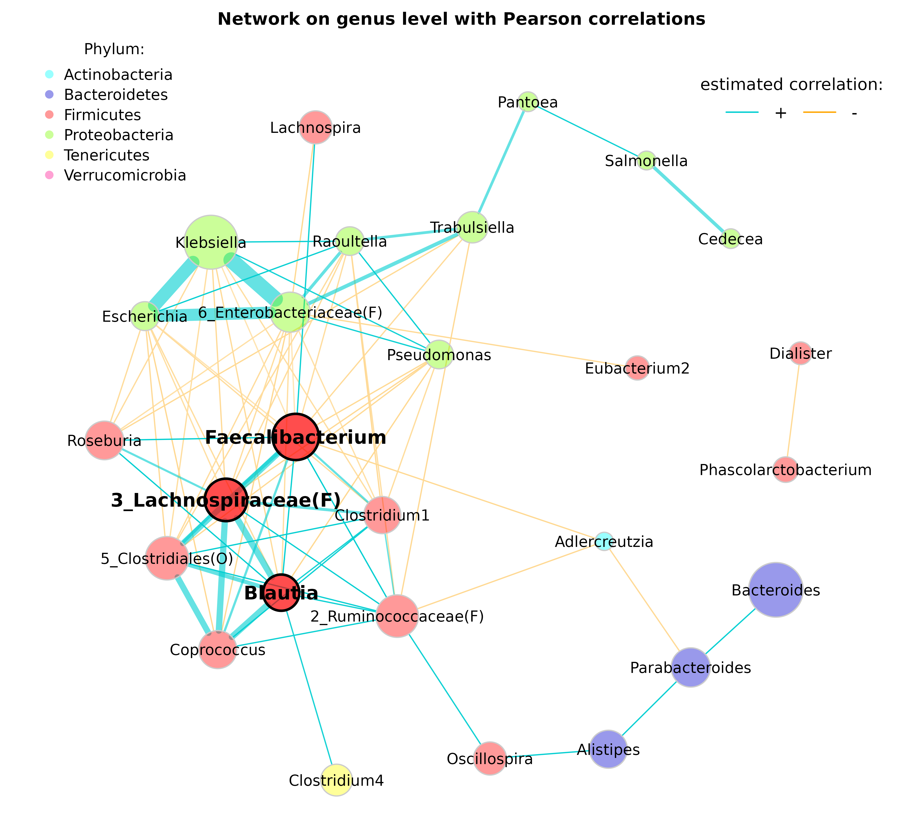
