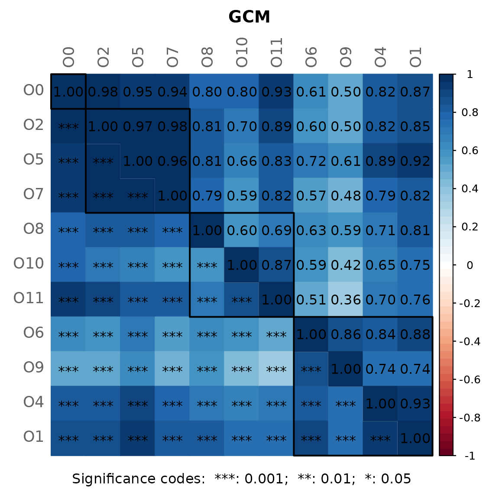
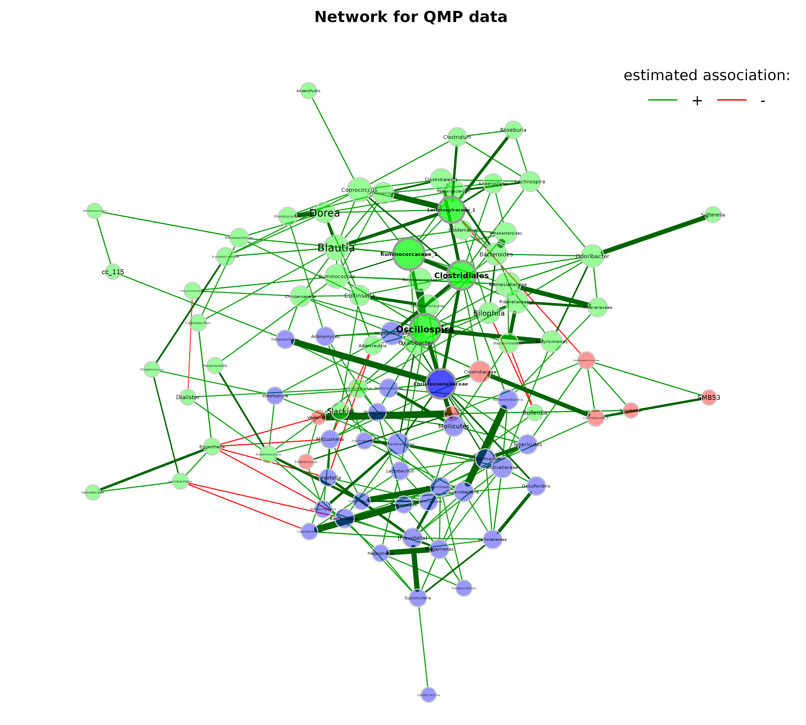

# Association matrix as input

``` r

library(NetCoMi)
```

This demonstrates how to use the NetCoMi workflow when you already have
an association matrix on which to base the network.

The QMP data set provided by the `SPRING` package is used to demonstrate
how NetCoMi is used to analyze a precomputed network (given as
association matrix).

The data set contains quantitative count data (true absolute values),
which SPRING can deal with. See
[`?QMP`](https://rdrr.io/pkg/SPRING/man/QMP.html) for details.

`nlambda` and `rep.num` are set to 10 for a decreased execution time,
but should be higher for real data.

``` r

library(SPRING)

# Load the QMP data set
data("QMP") 

# Run SPRING for association estimation
fit_spring <- SPRING(QMP, 
                     quantitative = TRUE, 
                     lambdaseq = "data-specific",
                     nlambda = 10, 
                     rep.num = 10,
                     seed = 123456, 
                     ncores = 1,
                     Rmethod = "approx",
                     verbose = FALSE)

# Optimal lambda
opt.K <- fit_spring$output$stars$opt.index
    
# Association matrix
assoMat <- as.matrix(SpiecEasi::symBeta(fit_spring$output$est$beta[[opt.K]],
                                        mode = "ave"))
rownames(assoMat) <- colnames(assoMat) <- colnames(QMP)
```

The association matrix is now passed to `netConstruct` to start the
usual NetCoMi workflow. Note that the `dataType` argument must be set
appropriately.

``` r

# Network construction and analysis
net_asso <- netConstruct(data = assoMat,
                         dataType = "condDependence",
                         sparsMethod = "none",
                         verbose = 0)

props_asso <- netAnalyze(net_asso, clustMethod = "hierarchical")
```



``` r

plot(props_asso,
     layout = "spring",
     repulsion = 1.2,
     shortenLabels = "none",
     labelScale = TRUE,
     rmSingles = TRUE,
     nodeSize = "eigenvector",
     nodeSizeSpread = 2,
     nodeColor = "cluster",
     hubBorderCol = "gray60",
     cexNodes = 1.8,
     cexLabels = 2,
     cexHubLabels = 2.2,
     title1 = "Network for QMP data", 
     showTitle = TRUE,
     cexTitle = 2.3)

legend(0.7, 1.1, cex = 2.2, title = "estimated association:",
       legend = c("+","-"), lty = 1, lwd = 3, col = c("#009900","red"), 
       bty = "n", horiz = TRUE)
```


