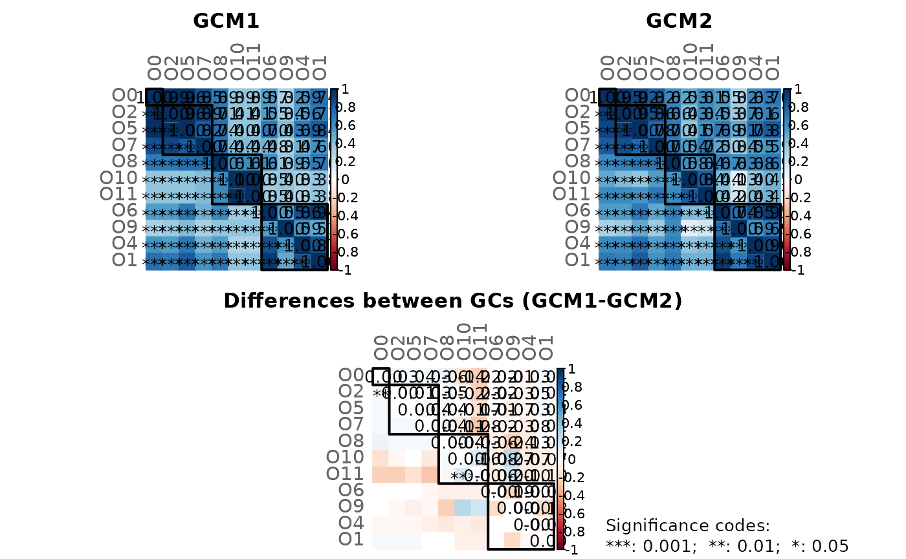
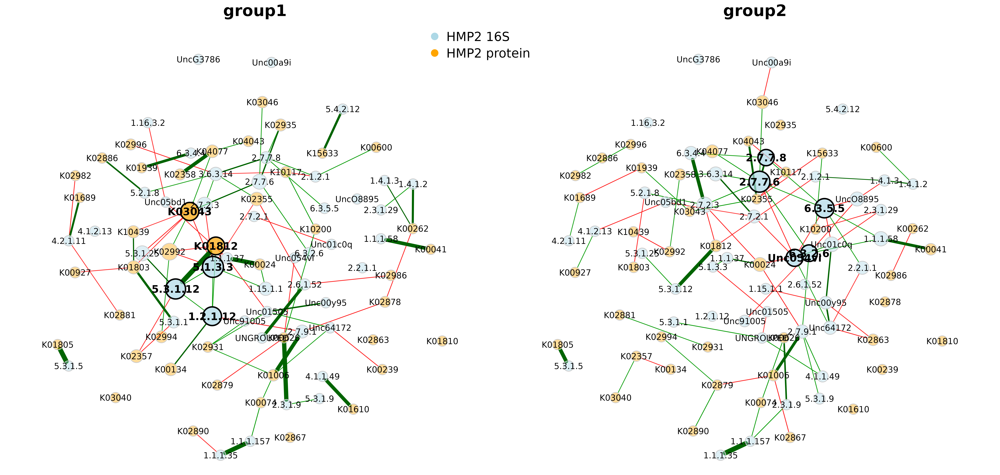

# Cross-domain networks

``` r

library(NetCoMi)
```

This tutorial shows how to construct a cross-domain network (e.g. a
network consisting of bacteria and fungi) using SpiecEasi’s ability to
estimate cross-domain associations.

We use the same data as in the “Cross domain interactions” section of
the [SpiecEasi tutorial](https://github.com/zdk123/SpiecEasi).

The samples are split into two groups and cross-domain associations are
computed for each group using SpiecEasi. The association matrices are
then passed to NetCoMi’s netConstruct() function to conduct a network
comparison between the two groups.

**Note:**  
This tutorial explains how two cross-domain networks are constructed and
**compared**. For constructing a single network, skip the step where the
data are split into two groups and perform the framework only for a
single data set (i.e. pass the estimated association matrix to the
“data” argument of netConstruct() and continue with NetCoMi’s standard
pipeline).

``` r

library(SpiecEasi)
library(phyloseq)

data(hmp2)

# Store count matrices (taxa are columns)
counts_hmp216S <- as.matrix(t(phyloseq::otu_table(hmp216S)@.Data))
counts_hmp2prot <- as.matrix(t(phyloseq::otu_table(hmp2prot)@.Data))

# Assume, the first 23 samples are in one group and the remaining 24 samples in the other group
group_vec <- c(rep(1, 23), rep(2, 24))

# Split count matrices
counts_hmp216S_gr1 <- counts_hmp216S[group_vec == 1, ]
counts_hmp216S_gr2 <- counts_hmp216S[group_vec == 2, ]

counts_hmp2prot_gr1 <- counts_hmp2prot[group_vec == 1, ]
counts_hmp2prot_gr2 <- counts_hmp2prot[group_vec == 2, ]

set.seed(123456)

# Run SpiecEasi and create association matrix for group 1
# Note: Increase nlambda and rep.num for real data sets
spiec_result_gr1 <- multi.spiec.easi(list(counts_hmp216S_gr1, 
                                          counts_hmp2prot_gr1), 
                                     method='mb', 
                                     nlambda=10, 
                                     lambda.min.ratio=1e-2, 
                                     pulsar.params = list(thresh = 0.05,
                                                          rep.num = 10))
#> Applying data transformations...
#> Selecting model with pulsar using stars...
#> Fitting final estimate with mb...
#> done

assoMat1 <- SpiecEasi::symBeta(SpiecEasi::getOptBeta(spiec_result_gr1), mode = "ave")

assoMat1 <- as.matrix(assoMat1)

# Run SpiecEasi and create association matrix for group 2
# Note: Increase nlambda and rep.num for real data sets
spiec_result_gr2 <- multi.spiec.easi(list(counts_hmp216S_gr2, 
                                          counts_hmp2prot_gr2), 
                                     method='mb', 
                                     nlambda=10,
                                     lambda.min.ratio=1e-2, 
                                     pulsar.params = list(thresh = 0.05,
                                                          rep.num = 10))
#> Applying data transformations...
#> Selecting model with pulsar using stars...
#> Fitting final estimate with mb...
#> done


assoMat2 <- SpiecEasi::symBeta(SpiecEasi::getOptBeta(spiec_result_gr2), mode = "ave")

assoMat2 <- as.matrix(assoMat2)

# Get taxa names
taxnames <- c(taxa_names(hmp216S), taxa_names(hmp2prot))

colnames(assoMat1) <- rownames(assoMat1) <- taxnames
diag(assoMat1) <- 1

colnames(assoMat2) <- rownames(assoMat2) <- taxnames
diag(assoMat2) <- 1
```

``` r

# NetCoMi workflow 

library(NetCoMi)

# Network construction (pass association matrices to netConstruct)
# - sparsMethod must be set to "none" because sparsification is already included in SpiecEasi
net_hmp_16S_prot <- netConstruct(data = assoMat1, data2 = assoMat2, 
                                 dataType = "condDependence", 
                                 sparsMethod = "none")
#> Checking input arguments ... Done.

# Network analysis
netprops_hmp_16S_prot <- netAnalyze(net_hmp_16S_prot, hubPar = "eigenvector")
```



``` r


nodeCols <- c(rep("lightblue", ntaxa(hmp216S)), rep("orange", ntaxa(hmp2prot)))
names(nodeCols) <- taxnames

plot(netprops_hmp_16S_prot, 
     sameLayout = TRUE, 
     layoutGroup = "union",
     nodeColor = "colorVec", 
     colorVec = nodeCols,
     nodeSize = "eigen", 
     nodeSizeSpread = 2,
     labelScale = FALSE,
     cexNodes = 2, 
     cexLabels = 2,
     cexHubLabels = 2.5,
     cexTitle = 3.8,
     groupNames = c("group1", "group2"))


legend(-0.2, 1.2, cex = 3, pt.cex = 4, 
       legend = c("HMP2 16S", "HMP2 protein"), col = c("lightblue", "orange"), 
       bty = "n", pch = 16) 
```



``` r

# Network comparison
# - Permutation tests cannot be performed because the association matrices are
#   used for network construction. For permutation tests, however, the count 
#   data are needed.
netcomp_hmp_16S_prot <- netCompare(netprops_hmp_16S_prot, permTest = FALSE)
#> Checking input arguments ... Done.

summary(netcomp_hmp_16S_prot, groupNames = c("group1", "group2"))
```

    #> 
    #> Comparison of Network Properties
    #> ----------------------------------
    #> CALL: 
    #> netCompare(x = netprops_hmp_16S_prot, permTest = FALSE)
    #> 
    #> ______________________________
    #> Global network properties
    #> `````````````````````````
    #> Largest connected component (LCC):
    #>                          group1   group2    difference
    #> Relative LCC size         0.716    0.693         0.023
    #> Clustering coefficient    0.028    0.106         0.078
    #> Modularity                0.682    0.650         0.032
    #> Positive edge percentage 65.333   57.333         8.000
    #> Edge density              0.038    0.041         0.003
    #> Natural connectivity      0.019    0.020         0.001
    #> Vertex connectivity       1.000    1.000         0.000
    #> Edge connectivity         1.000    1.000         0.000
    #> Average dissimilarity*    0.988    0.988         0.000
    #> Average path length**     3.813    3.912         0.099
    #> 
    #> Whole network:
    #>                          group1   group2    difference
    #> Number of components     17.000   18.000         1.000
    #> Clustering coefficient    0.027    0.095         0.068
    #> Modularity                0.731    0.704         0.027
    #> Positive edge percentage 65.476   60.465         5.011
    #> Edge density              0.022    0.022         0.001
    #> Natural connectivity      0.013    0.013         0.000
    #> -----
    #>  *: Dissimilarity = 1 - edge weight
    #> **: Path length = Units with average dissimilarity
    #> 
    #> ______________________________
    #> Jaccard index (similarity betw. sets of most central nodes)
    #> ```````````````````````````````````````````````````````````
    #>                     Jacc   P(<=Jacc)     P(>=Jacc)   
    #> degree             0.172    0.045131 *    0.983900   
    #> betweenness centr. 0.265    0.256412      0.849120   
    #> closeness centr.   0.257    0.221235      0.873473   
    #> eigenvec. centr.   0.189    0.041409 *    0.983142   
    #> hub taxa           0.000    0.017342 *    1.000000   
    #> -----
    #> Jaccard index in [0,1] (1 indicates perfect agreement)
    #> 
    #> ______________________________
    #> Adjusted Rand index (similarity betw. clusterings)
    #> ``````````````````````````````````````````````````
    #>         wholeNet       LCC
    #> ARI        0.043     0.014
    #> p-value    0.015     0.463
    #> -----
    #> ARI in [-1,1] with ARI=1: perfect agreement betw. clusterings
    #>                    ARI=0: expected for two random clusterings
    #> p-value: permutation test (n=1000) with null hypothesis ARI=0
    #> 
    #> ______________________________
    #> Graphlet Correlation Distance
    #> `````````````````````````````
    #>     wholeNet       LCC
    #> GCD    0.685     0.784
    #> -----
    #> GCD >= 0 (GCD=0 indicates perfect agreement between GCMs)
    #> 
    #> ______________________________
    #> Centrality measures
    #> - In decreasing order
    #> - Centrality of disconnected components is zero
    #> ````````````````````````````````````````````````
    #> Degree (normalized):
    #>          group1 group2 abs.diff.
    #> 6.3.5.5   0.011  0.080     0.069
    #> 6.3.2.6   0.011  0.069     0.057
    #> 1.2.1.12  0.057  0.000     0.057
    #> 5.1.3.3   0.080  0.023     0.057
    #> Unc054vi  0.011  0.057     0.046
    #> Unc01c0q  0.000  0.046     0.046
    #> K00626    0.046  0.000     0.046
    #> K03043    0.069  0.023     0.046
    #> UncO8895  0.000  0.034     0.034
    #> Unc00y95  0.011  0.046     0.034
    #> 
    #> Betweenness centrality (normalized):
    #>          group1 group2 abs.diff.
    #> 5.1.3.3   0.499  0.029     0.470
    #> 1.2.1.12  0.352  0.000     0.352
    #> 2.7.7.6   0.132  0.479     0.347
    #> Unc01c0q  0.000  0.338     0.338
    #> 6.3.5.5   0.000  0.324     0.324
    #> 6.3.2.6   0.000  0.297     0.297
    #> 2.3.1.29  0.000  0.259     0.259
    #> K15633    0.000  0.210     0.210
    #> 3.6.3.14  0.360  0.162     0.197
    #> K10117    0.178  0.000     0.178
    #> 
    #> Closeness centrality (normalized):
    #>          group1 group2 abs.diff.
    #> 1.2.1.12  0.491  0.000     0.491
    #> UncO8895  0.000  0.466     0.466
    #> Unc01c0q  0.000  0.460     0.460
    #> 1.1.1.58  0.000  0.455     0.455
    #> 2.7.2.1   0.000  0.420     0.420
    #> 6.3.4.4   0.000  0.415     0.415
    #> 2.2.1.1   0.000  0.402     0.402
    #> K02935    0.392  0.000     0.392
    #> 4.1.1.49  0.000  0.380     0.380
    #> 2.6.1.52  0.377  0.000     0.377
    #> 
    #> Eigenvector centrality (normalized):
    #>          group1 group2 abs.diff.
    #> 5.1.3.3   1.000  0.025     0.975
    #> 5.3.1.12  0.911  0.048     0.863
    #> 6.3.5.5   0.040  0.840     0.800
    #> 1.2.1.12  0.786  0.000     0.786
    #> K03043    0.730  0.000     0.730
    #> Unc054vi  0.002  0.627     0.625
    #> K02992    0.616  0.023     0.593
    #> 2.7.7.6   0.431  1.000     0.569
    #> K01812    0.689  0.140     0.549
    #> 6.3.2.6   0.114  0.592     0.478
    #> 
    #> _________________________________________________________
    #> Significance codes: ***: 0.001, **: 0.01, *: 0.05, .: 0.1
