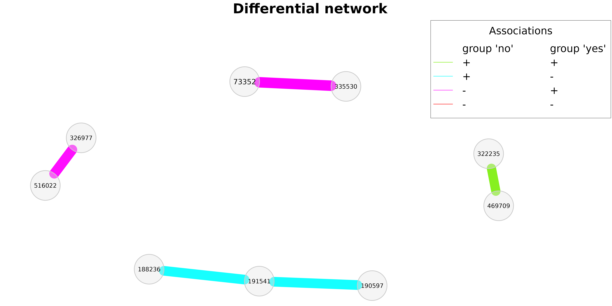
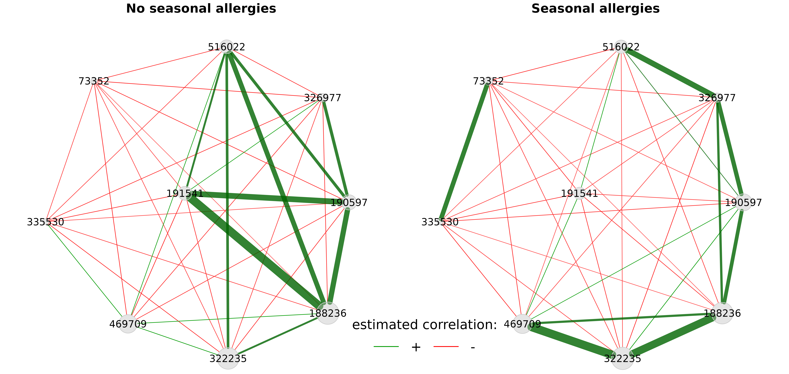

# Differential networks

``` r

library(NetCoMi)
```

A further possibility to compare two networks are so called
*differential networks*, where two nodes are connected if they are
differentially associated between the two groups.

We start by dividing the amgut data set into two groups: samples with
and without seasonal allergies.

``` r

data("amgut2.filt.phy")

# Split the phyloseq object into two groups
amgut_season_yes <- phyloseq::subset_samples(amgut2.filt.phy, 
                                             SEASONAL_ALLERGIES == "yes")
amgut_season_no <- phyloseq::subset_samples(amgut2.filt.phy, 
                                            SEASONAL_ALLERGIES == "no")

amgut_season_yes
#> phyloseq-class experiment-level object
#> otu_table()   OTU Table:         [ 138 taxa and 121 samples ]
#> sample_data() Sample Data:       [ 121 samples by 166 sample variables ]
#> tax_table()   Taxonomy Table:    [ 138 taxa by 7 taxonomic ranks ]
amgut_season_no
#> phyloseq-class experiment-level object
#> otu_table()   OTU Table:         [ 138 taxa and 163 samples ]
#> sample_data() Sample Data:       [ 163 samples by 166 sample variables ]
#> tax_table()   Taxonomy Table:    [ 138 taxa by 7 taxonomic ranks ]
```

Due to its very short execution time, we use Pearson’s correlations for
estimating associations between OTUs.

Fisher’s z-test is applied for identifying differentially correlated
OTUs. Multiple testing adjustment is done by controlling the local false
discovery rate.

Note: `sparsMethod` is set to `"none"`, just to be able to include all
differential associations in the association network plot (see below).
However, the differential network is always based on the estimated
association matrices before sparsification (the `assoEst1` and
`assoEst2` matrices returned by
[`netConstruct()`](https://netcomi.de/reference/netConstruct.md)).

``` r

net_season_pears <- netConstruct(data = amgut_season_no, 
                                 data2 = amgut_season_yes, 
                                 filtTax = "highestVar",
                                 filtTaxPar = list(highestVar = 50),
                                 measure = "pearson", 
                                 normMethod = "clr",
                                 sparsMethod = "none", 
                                 thresh = 0.2,
                                 verbose = 3)
#> Checking input arguments ... Done.
#> Infos about changed arguments:
#> Zero replacement needed for clr transformation. "multRepl" used.
#> 
#> Data filtering ...
#> 95 taxa removed in each data set.
#> 1 rows with zero sum removed in group 1.
#> 1 rows with zero sum removed in group 2.
#> 43 taxa and 162 samples remaining in group 1.
#> 43 taxa and 120 samples remaining in group 2.
#> 
#> Zero treatment in group 1:
#> Execute multRepl() ... Done.
#> 
#> Zero treatment in group 2:
#> Execute multRepl() ... Done.
#> 
#> Normalization in group 1:
#> Execute clr(){SpiecEasi} ... Done.
#> 
#> Normalization in group 2:
#> Execute clr(){SpiecEasi} ... Done.
#> 
#> Calculate 'pearson' associations ... Done.
#> 
#> Calculate associations in group 2 ... Done.

# Differential network construction
diff_season <- diffnet(net_season_pears,
                       diffMethod = "fisherTest", 
                       adjust = "lfdr")
#> Checking input arguments ... 
#> Done.
#> Adjust for multiple testing using 'lfdr' ... 
#> Execute fdrtool() ...
#> Step 1... determine cutoff point
#> Step 2... estimate parameters of null distribution and eta0
#> Step 3... compute p-values and estimate empirical PDF/CDF
#> Step 4... compute q-values and local fdr
#> Done.

# Differential network plot
plot(diff_season, 
     cexNodes = 0.8, 
     cexLegend = 3,
     cexTitle = 4,
     mar = c(2,2,8,5),
     legendGroupnames = c("group 'no'", "group 'yes'"),
     legendPos = c(0.7,1.6))
```



In the differential network shown above, edge colors represent the
direction of associations in the two groups. If, for instance, two OTUs
are positively associated in group 1 and negatively associated in group
2 (such as ‘191541’ and ‘188236’), the respective edge is colored in
cyan.

We also take a look at the corresponding associations by constructing
association networks that include only the differentially associated
OTUs.

``` r

props_season_pears <- netAnalyze(net_season_pears, 
                                 clustMethod = "cluster_fast_greedy",
                                 weightDeg = TRUE,
                                 normDeg = FALSE,
                                 gcmHeat = FALSE)
```

``` r

# Identify the differentially associated OTUs
diffmat_sums <- rowSums(diff_season$diffAdjustMat)
diff_asso_names <- names(diffmat_sums[diffmat_sums > 0])

plot(props_season_pears, 
     nodeFilter = "names",
     nodeFilterPar = diff_asso_names,
     nodeColor = "gray",
     highlightHubs = FALSE,
     sameLayout = TRUE, 
     layoutGroup = "union",
     rmSingles = FALSE, 
     nodeSize = "clr",
     edgeTranspHigh = 20,
     labelScale = FALSE,
     cexNodes = 1.5, 
     cexLabels = 3,
     cexTitle = 3.8,
     groupNames = c("No seasonal allergies", "Seasonal allergies"),
     hubBorderCol  = "gray40")

legend(-0.15,-0.7, title = "estimated correlation:", legend = c("+","-"), 
       col = c("#009900","red"), inset = 0.05, cex = 4, lty = 1, lwd = 4, 
       bty = "n", horiz = TRUE)
```



We can see that the correlation between the aforementioned OTUs ‘191541’
and ‘188236’ is strongly positive in the left group and negative in the
right group.
