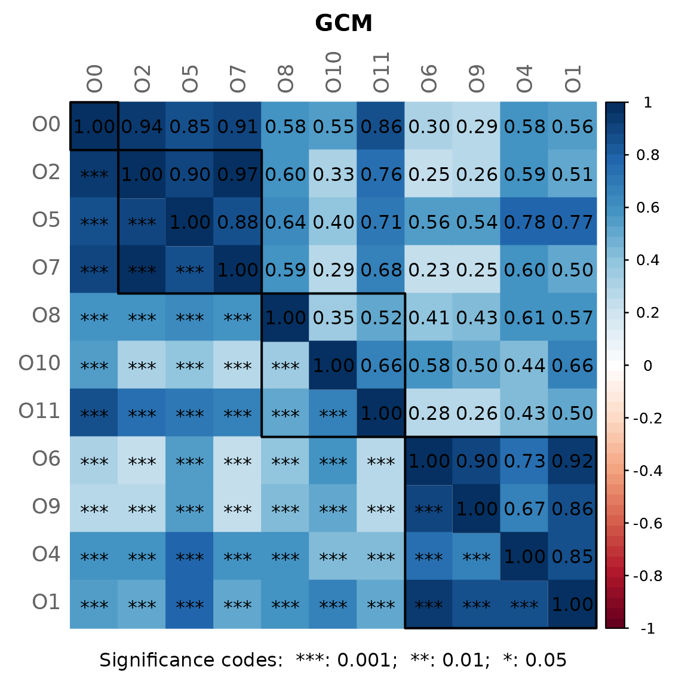
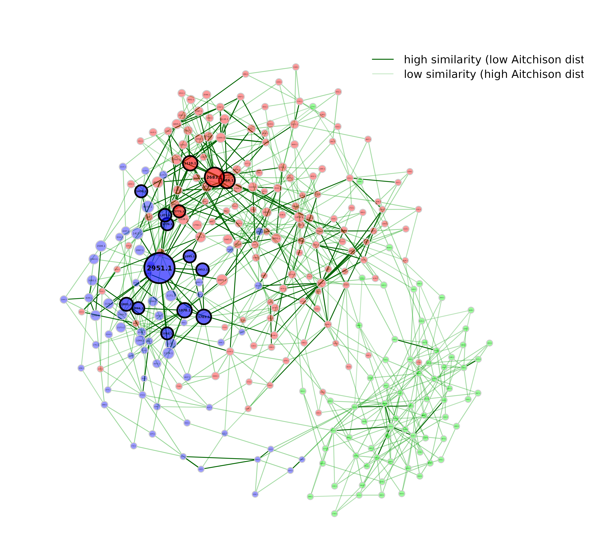

# Dissimilarity-based Networks

``` r

library(NetCoMi)
```

If a **dissimilarity** measure is used for network construction, **nodes
are subjects** instead of OTUs. The estimated dissimilarities are
transformed into similarities, which are used as edge weights so that
subjects with a similar microbial composition are placed close together
in the network plot.

We construct a single network using Aitchison’s distance being suitable
for the application on compositional data.

Since the Aitchison distance is based on the clr-transformation, zeros
in the data need to be replaced.

The network is sparsified using the k-nearest neighbor (knn) algorithm.

``` r

data("amgut1.filt")

net_diss <- netConstruct(amgut1.filt,
                         measure = "aitchison",
                         zeroMethod = "multRepl",
                         sparsMethod = "knn",
                         kNeighbor = 3,
                         verbose = 3)
#> Checking input arguments ... Done.
#> Infos about changed arguments:
#> Counts normalized to fractions for measure "aitchison".
#> 
#> 127 taxa and 289 samples remaining.
#> 
#> Zero treatment:
#> Execute multRepl() ... Done.
#> 
#> Normalization:
#> Counts normalized by total sum scaling.
#> 
#> Calculate 'aitchison' dissimilarities ... Done.
#> 
#> Sparsify dissimilarities via 'knn' ... Done.
```

For cluster detection, we use hierarchical clustering with average
linkage. Internally, `k=3` is passed to
[`cutree()`](https://www.rdocumentation.org/packages/dendextend/versions/1.13.4/topics/cutree)
from `stats` package so that the tree is cut into 3 clusters.

``` r

props_diss <- netAnalyze(net_diss,
                         clustMethod = "hierarchical",
                         clustPar = list(method = "average", k = 3),
                         hubPar = "eigenvector")
```



``` r

plot(props_diss, 
     nodeColor = "cluster", 
     nodeSize = "eigenvector",
     hubTransp = 40,
     edgeTranspLow = 60,
     charToRm = "00000",
     shortenLabels = "simple",
     labelLength = 6,
     mar = c(1, 3, 3, 5))

# get green color with 50% transparency
green2 <- colToTransp("#009900", 40)

legend(0.4, 1.1,
       cex = 2.2,
       legend = c("high similarity (low Aitchison distance)",
                  "low similarity (high Aitchison distance)"), 
       lty = 1, 
       lwd = c(3, 1),
       col = c("darkgreen", green2),
       bty = "n")
```



In this dissimilarity-based network, hubs are interpreted as samples
with a microbial composition similar to that of many other samples in
the data set.
