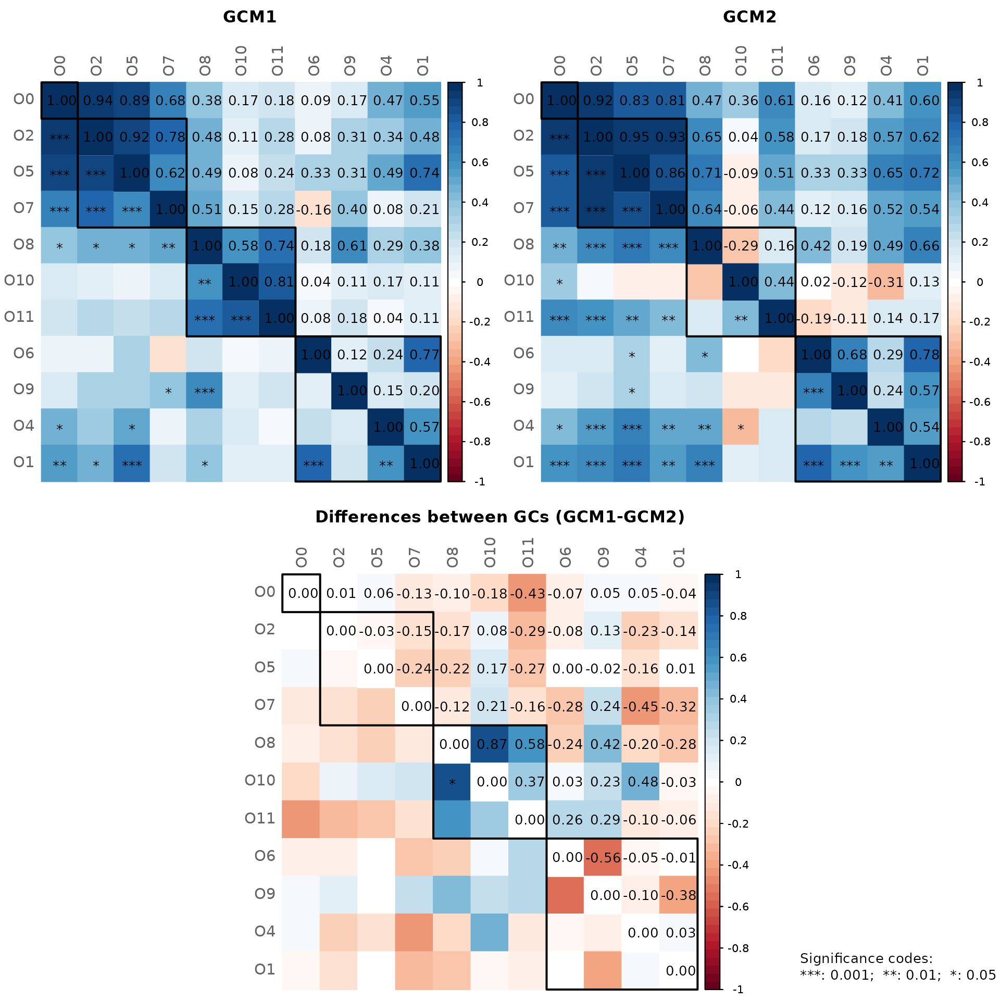
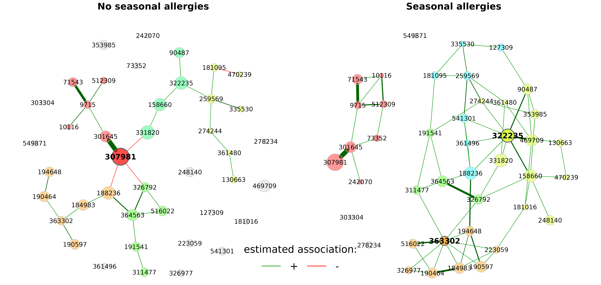
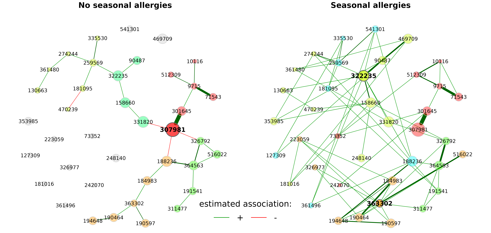
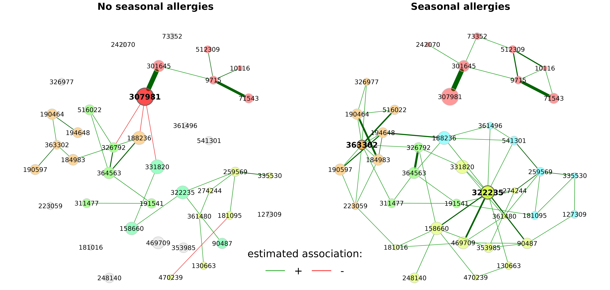

# Network comparison

``` r

library(NetCoMi)
```

One of NetCoMi’s strengths is the ability to compare networks between
two groups. The
[`netCompare()`](https://netcomi.de/reference/netCompare.md) function is
used for this task.

### Network construction

The amgut data set is split by `"SEASONAL_ALLERGIES"` leading to two
subsets of samples (with and without seasonal allergies). We ignore the
“None” group.

``` r

data("amgut2.filt.phy")

# Split the phyloseq object into two groups
amgut_season_yes <- phyloseq::subset_samples(amgut2.filt.phy, 
                                             SEASONAL_ALLERGIES == "yes")
amgut_season_no <- phyloseq::subset_samples(amgut2.filt.phy, 
                                            SEASONAL_ALLERGIES == "no")

amgut_season_yes
#> phyloseq-class experiment-level object
#> otu_table()   OTU Table:         [ 138 taxa and 121 samples ]
#> sample_data() Sample Data:       [ 121 samples by 166 sample variables ]
#> tax_table()   Taxonomy Table:    [ 138 taxa by 7 taxonomic ranks ]
amgut_season_no
#> phyloseq-class experiment-level object
#> otu_table()   OTU Table:         [ 138 taxa and 163 samples ]
#> sample_data() Sample Data:       [ 163 samples by 166 sample variables ]
#> tax_table()   Taxonomy Table:    [ 138 taxa by 7 taxonomic ranks ]
```

The 50 nodes with highest variance are selected for network construction
to get smaller networks.

We filter the 121 samples (sample size of the smaller group) with
highest frequency to make the sample sizes equal and thus ensure
comparability.

``` r

n_yes <- phyloseq::nsamples(amgut_season_yes)

# Network construction
net_season <- netConstruct(data = amgut_season_no, 
                           data2 = amgut_season_yes,  
                           filtTax = "highestVar",
                           filtTaxPar = list(highestVar = 50),
                           filtSamp = "highestFreq",
                           filtSampPar = list(highestFreq = n_yes),
                           measure = "spring",
                           measurePar = list(nlambda = 10, 
                                             rep.num = 10,
                                             Rmethod = "approx"),
                           normMethod = "none", 
                           zeroMethod = "none",
                           sparsMethod = "none", 
                           dissFunc = "signed",
                           verbose = 2,
                           seed = 123456)
#> Checking input arguments ... Done.
#> Data filtering ...
#> 42 samples removed in data set 1.
#> 0 samples removed in data set 2.
#> 96 taxa removed in each data set.
#> 1 rows with zero sum removed in group 2.
#> 42 taxa and 121 samples remaining in group 1.
#> 42 taxa and 120 samples remaining in group 2.
#> 
#> Calculate 'spring' associations ... Done.
#> 
#> Calculate associations in group 2 ... Done.
```

Alternatively, a group vector could be passed to `group`, according to
which the data set is split into two groups:

``` r

# Get count table
countMat <- phyloseq::otu_table(amgut2.filt.phy)

# netConstruct() expects samples in rows
countMat <- t(as(countMat, "matrix"))

group_vec <- phyloseq::get_variable(amgut2.filt.phy, "SEASONAL_ALLERGIES")

# Select the two groups of interest (level "none" is excluded)
sel <- which(group_vec %in% c("no", "yes"))
group_vec <- group_vec[sel]
countMat <- countMat[sel, ]

net_season <- netConstruct(countMat, 
                           group = group_vec, 
                           filtTax = "highestVar",
                           filtTaxPar = list(highestVar = 50),
                           filtSamp = "highestFreq",
                           filtSampPar = list(highestFreq = n_yes),
                           measure = "spring",
                           measurePar = list(nlambda=10, 
                                             rep.num=10,
                                             Rmethod = "approx"),
                           normMethod = "none", 
                           zeroMethod = "none",
                           sparsMethod = "none", 
                           dissFunc = "signed",
                           verbose = 3,
                           seed = 123456)
```

### Network analysis

The object returned by
[`netConstruct()`](https://netcomi.de/reference/netConstruct.md)
containing both networks is again passed to
[`netAnalyze()`](https://netcomi.de/reference/netAnalyze.md). Network
properties are computed for both networks simultaneously.

To demonstrate further functionalities of
[`netAnalyze()`](https://netcomi.de/reference/netAnalyze.md), we play
around with the available arguments, even if the chosen setting might
not be optimal.

- `centrLCC = FALSE`: Centralities are calculated for all nodes (not
  only for the largest connected component).
- `avDissIgnoreInf = TRUE`: Nodes with an infinite dissimilarity are
  ignored when calculating the average dissimilarity.
- `sPathNorm = FALSE`: Shortest paths are not normalized by average
  dissimilarity.
- `hubPar = c("degree", "eigenvector")`: Hubs are nodes with highest
  degree and eigenvector centrality at the same time.
- `lnormFit = TRUE` and `hubQuant = 0.9`: A log-normal distribution is
  fitted to the centrality values to identify nodes with “highest”
  centrality values. Here, a node is identified as hub if for each of
  the three centrality measures, the node’s centrality value is above
  the 90% quantile of the fitted log-normal distribution.
- The non-normalized centralities are used for all four measures.

**Note! The arguments must be set carefully, depending on the research
questions. NetCoMi’s default values are not generally preferable in all
practical cases!**

``` r

props_season <- netAnalyze(net_season, 
                           centrLCC = FALSE,
                           avDissIgnoreInf = TRUE,
                           sPathNorm = FALSE,
                           clustMethod = "cluster_fast_greedy",
                           hubPar = c("degree", "eigenvector"),
                           hubQuant = 0.9,
                           lnormFit = TRUE,
                           normDeg = FALSE,
                           normBetw = FALSE,
                           normClose = FALSE,
                           normEigen = FALSE)
#> Warning: The `normEigen` argument of `netAnalyze()` always as if TRUE as of NetCoMi
#> 1.2.0.
#> ℹ Normalization is always performed (due to changes in igraph).
#> ℹ The deprecated feature was likely used in the NetCoMi package.
#>   Please report the issue at <https://github.com/stefpeschel/NetCoMi/issues>.
#> This warning is displayed once per session.
#> Call `lifecycle::last_lifecycle_warnings()` to see where this warning was
#> generated.
```



``` r


summary(props_season)
```

    #> 
    #> Component sizes
    #> ```````````````
    #> group '1':           
    #> size: 28  1
    #>    #:  1 14
    #> group '2':            
    #> size: 31 8 1
    #>    #:  1 1 3
    #> ______________________________
    #> Global network properties
    #> `````````````````````````
    #> Largest connected component (LCC):
    #>                          group '1' group '2'
    #> Relative LCC size          0.66667   0.73810
    #> Clustering coefficient     0.08417   0.27105
    #> Modularity                 0.63165   0.46480
    #> Positive edge percentage  86.20690 100.00000
    #> Edge density               0.07672   0.12473
    #> Natural connectivity       0.04519   0.04362
    #> Vertex connectivity        1.00000   1.00000
    #> Edge connectivity          1.00000   1.00000
    #> Average dissimilarity*     0.67094   0.68174
    #> Average path length**      3.49723   1.86731
    #> 
    #> Whole network:
    #>                          group '1' group '2'
    #> Number of components      15.00000   5.00000
    #> Clustering coefficient     0.08417   0.29065
    #> Modularity                 0.63165   0.56483
    #> Positive edge percentage  86.20690 100.00000
    #> Edge density               0.03368   0.07898
    #> Natural connectivity       0.02817   0.03098
    #> -----
    #> *: Dissimilarity = 1 - edge weight
    #> **: Path length = Sum of dissimilarities along the path
    #> 
    #> ______________________________
    #> Clusters
    #> - In the whole network
    #> - Algorithm: cluster_fast_greedy
    #> ```````````````````````````````` 
    #> group '1':                  
    #> name:  0 1 2 3 4 5
    #>    #: 14 6 7 6 5 4
    #> 
    #> group '2':                  
    #> name: 0  1 2 3 4 5
    #>    #: 3 12 7 8 4 8
    #> 
    #> ______________________________
    #> Hubs
    #> - In alphabetical/numerical order
    #> - Based on log-normal quantiles of centralities
    #> ```````````````````````````````````````````````
    #>  group '1' group '2'
    #>     307981    322235
    #>               363302
    #> 
    #> ______________________________
    #> Centrality measures
    #> - In decreasing order
    #> - Computed for the complete network
    #> ````````````````````````````````````
    #> Degree (unnormalized):
    #>         group '1' group '2'
    #>  307981         4         1
    #>  364563         4         4
    #>  259569         4         5
    #>    9715         4         4
    #>  322235         3         9
    #>            ______    ______
    #>  322235         3         9
    #>  363302         3         9
    #>  158660         2         6
    #>  188236         3         5
    #>  259569         4         5
    #> 
    #> Betweenness centrality (unnormalized):
    #>         group '1' group '2'
    #>  307981       231         0
    #>  331820       170         9
    #>  158660       162        80
    #>  188236       161        85
    #>  322235       159       126
    #>            ______    ______
    #>  322235       159       126
    #>  363302        74        93
    #>  188236       161        85
    #>  158660       162        80
    #>  326792        17        58
    #> 
    #> Closeness centrality (unnormalized):
    #>         group '1' group '2'
    #>  307981  17.14918   6.78191
    #>  188236  15.40468  23.24601
    #>  301645  15.35263   9.05751
    #>  364563  14.51896  21.22259
    #>  326792  14.22404  22.52758
    #>            ______    ______
    #>  322235  13.37013  26.37732
    #>  363302  12.16722   24.1953
    #>  158660  12.85956  23.32039
    #>  188236  15.40468  23.24601
    #>  326792  14.22404  22.52758
    #> 
    #> Eigenvector centrality (unnormalized):
    #>         group '1' group '2'
    #>  307981         1   0.08113
    #>  364563   0.83344   0.36357
    #>  326792   0.77866   0.42007
    #>  301645   0.75823   0.14825
    #>  188236   0.71842   0.56563
    #>            ______    ______
    #>  322235    0.0519   0.79487
    #>  363302   0.13366   0.76034
    #>  188236   0.71842   0.56563
    #>  194648   0.01751   0.51921
    #>  184983   0.29503   0.49496

### Visual network comparison

First, the layout is computed separately in both groups (qgraph’s
“spring” layout in this case).

Node sizes are scaled according to the mclr-transformed data since
`SPRING` uses the mclr transformation as normalization method.

Node colors represent clusters. Note that by default, two clusters have
the same color in both groups if they have at least two nodes in common
(`sameColThresh = 2`). Set `sameClustCol` to `FALSE` to get different
cluster colors.

``` r

plot(props_season, 
     sameLayout = FALSE, 
     nodeColor = "cluster",
     nodeSize = "mclr",
     labelScale = FALSE,
     cexNodes = 1.5, 
     cexLabels = 2.5,
     cexHubLabels = 3,
     cexTitle = 3.7,
     groupNames = c("No seasonal allergies", "Seasonal allergies"),
     hubBorderCol  = "gray40")

legend("bottom", title = "estimated association:", legend = c("+","-"), 
       col = c("#009900","red"), inset = 0.02, cex = 4, lty = 1, lwd = 4, 
       bty = "n", horiz = TRUE)
```



Using different layouts leads to a “nice-looking” network plot for each
group, however, it is difficult to identify group differences at first
glance.

Thus, we now use the same layout in both groups. In the following, the
layout is computed for group 1 (the left network) and taken over for
group 2.

`rmSingles` is set to `"inboth"` because only nodes that are unconnected
in both groups can be removed if the same layout is used.

``` r

plot(props_season, 
     sameLayout = TRUE, 
     layoutGroup = 1,
     rmSingles = "inboth", 
     nodeSize = "mclr", 
     labelScale = FALSE,
     cexNodes = 1.5, 
     cexLabels = 2.5,
     cexHubLabels = 3,
     cexTitle = 3.8,
     groupNames = c("No seasonal allergies", "Seasonal allergies"),
     hubBorderCol  = "gray40")

legend("bottom", title = "estimated association:", legend = c("+","-"), 
       col = c("#009900","red"), inset = 0.02, cex = 4, lty = 1, lwd = 4, 
       bty = "n", horiz = TRUE)
```



In the above plot, we can see clear differences between the groups. The
OTU “322235”, for instance, is more strongly connected in the “Seasonal
allergies” group than in the group without seasonal allergies, which is
why it is a hub on the right, but not on the left.

However, if the layout of one group is simply taken over to the other,
one of the networks (here the “seasonal allergies” group) is usually not
that nice-looking due to the long edges. Therefore, NetCoMi (\>= 1.0.2)
offers a further option (`layoutGroup = "union"`), where a union of the
two layouts is used in both groups. In doing so, the nodes are placed as
optimal as possible equally for both networks.

*The idea and R code for this functionality were provided by [Christian
L. Müller](https://github.com/muellsen?tab=followers) and [Alice
Sommer](https://www.iq.harvard.edu/people/alice-sommer)*

``` r

plot(props_season, 
     sameLayout = TRUE, 
     repulsion = 0.95,
     layoutGroup = "union",
     rmSingles = "inboth", 
     nodeSize = "mclr", 
     labelScale = FALSE,
     cexNodes = 1.5, 
     cexLabels = 2.5,
     cexHubLabels = 3,
     cexTitle = 3.8,
     groupNames = c("No seasonal allergies", "Seasonal allergies"),
     hubBorderCol  = "gray40")

legend("bottom", title = "estimated association:", legend = c("+","-"), 
       col = c("#009900","red"), inset = 0.02, cex = 4, lty = 1, lwd = 4, 
       bty = "n", horiz = TRUE)
```



### Quantitative network comparison

Since runtime is considerably increased if permutation tests are
performed, we set the `permTest` parameter to `FALSE`. See the
`tutorial_createAssoPerm` file for a network comparison including
permutation tests.

Since permutation tests are still conducted for the Adjusted Rand Index,
a seed should be set for reproducibility.

``` r

comp_season <- netCompare(props_season, 
                          permTest = FALSE, 
                          verbose = FALSE,
                          seed = 123456)

summary(comp_season, 
        groupNames = c("No allergies", "Allergies"),
        showCentr = c("degree", "between", "closeness"), 
        numbNodes = 5)
```

    #> 
    #> Comparison of Network Properties
    #> ----------------------------------
    #> CALL: 
    #> netCompare(x = props_season, permTest = FALSE, verbose = FALSE, 
    #>     seed = 123456)
    #> 
    #> ______________________________
    #> Global network properties
    #> `````````````````````````
    #> Largest connected component (LCC):
    #>                          No allergies   Allergies    difference
    #> Relative LCC size               0.667       0.738         0.071
    #> Clustering coefficient          0.084       0.271         0.187
    #> Modularity                      0.632       0.465         0.167
    #> Positive edge percentage       86.207     100.000        13.793
    #> Edge density                    0.077       0.125         0.048
    #> Natural connectivity            0.045       0.044         0.002
    #> Vertex connectivity             1.000       1.000         0.000
    #> Edge connectivity               1.000       1.000         0.000
    #> Average dissimilarity*          0.671       0.682         0.011
    #> Average path length**           3.497       1.867         1.630
    #> 
    #> Whole network:
    #>                          No allergies   Allergies    difference
    #> Number of components           15.000       5.000        10.000
    #> Clustering coefficient          0.084       0.291         0.206
    #> Modularity                      0.632       0.565         0.067
    #> Positive edge percentage       86.207     100.000        13.793
    #> Edge density                    0.034       0.079         0.045
    #> Natural connectivity            0.028       0.031         0.003
    #> -----
    #>  *: Dissimilarity = 1 - edge weight
    #> **: Path length = Sum of dissimilarities along the path
    #> 
    #> ______________________________
    #> Jaccard index (similarity betw. sets of most central nodes)
    #> ```````````````````````````````````````````````````````````
    #>                     Jacc   P(<=Jacc)     P(>=Jacc)   
    #> degree             0.444    0.855154      0.349693   
    #> betweenness centr. 0.333    0.650307      0.622822   
    #> closeness centr.   0.333    0.631521      0.606925   
    #> eigenvec. centr.   0.167    0.101665      0.967352   
    #> hub taxa           0.000    0.296296      1.000000   
    #> -----
    #> Jaccard index in [0,1] (1 indicates perfect agreement)
    #> 
    #> ______________________________
    #> Adjusted Rand index (similarity betw. clusterings)
    #> ``````````````````````````````````````````````````
    #>         wholeNet       LCC
    #> ARI        0.253     0.355
    #> p-value    0.000     0.000
    #> -----
    #> ARI in [-1,1] with ARI=1: perfect agreement betw. clusterings
    #>                    ARI=0: expected for two random clusterings
    #> p-value: permutation test (n=1000) with null hypothesis ARI=0
    #> 
    #> ______________________________
    #> Graphlet Correlation Distance
    #> `````````````````````````````
    #>     wholeNet       LCC
    #> GCD    1.563     1.943
    #> -----
    #> GCD >= 0 (GCD=0 indicates perfect agreement between GCMs)
    #> 
    #> ______________________________
    #> Centrality measures
    #> - In decreasing order
    #> - Computed for the whole network
    #> ````````````````````````````````````
    #> Degree (unnormalized):
    #>        No allergies Allergies abs.diff.
    #> 322235            3         9         6
    #> 363302            3         9         6
    #> 469709            0         4         4
    #> 158660            2         6         4
    #> 223059            0         4         4
    #> 
    #> Betweenness centrality (unnormalized):
    #>        No allergies Allergies abs.diff.
    #> 307981          231         0       231
    #> 331820          170         9       161
    #> 259569          137        34       103
    #> 158660          162        80        82
    #> 301645           92        11        81
    #> 
    #> Closeness centrality (unnormalized):
    #>        No allergies Allergies abs.diff.
    #> 469709            0    21.210    21.210
    #> 541301            0    20.947    20.947
    #> 181016            0    19.499    19.499
    #> 361496            0    19.353    19.353
    #> 223059            0    19.263    19.263
    #> 
    #> _________________________________________________________
    #> Significance codes: ***: 0.001, **: 0.01, *: 0.05, .: 0.1
