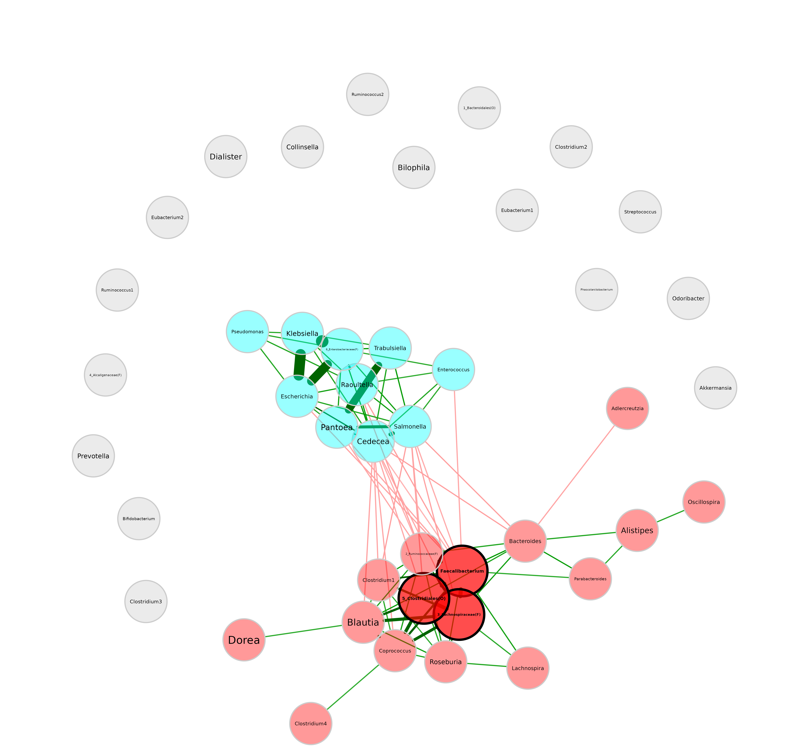
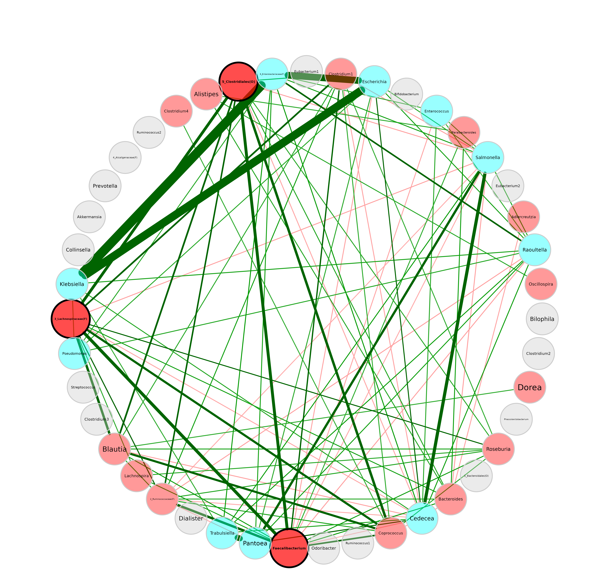
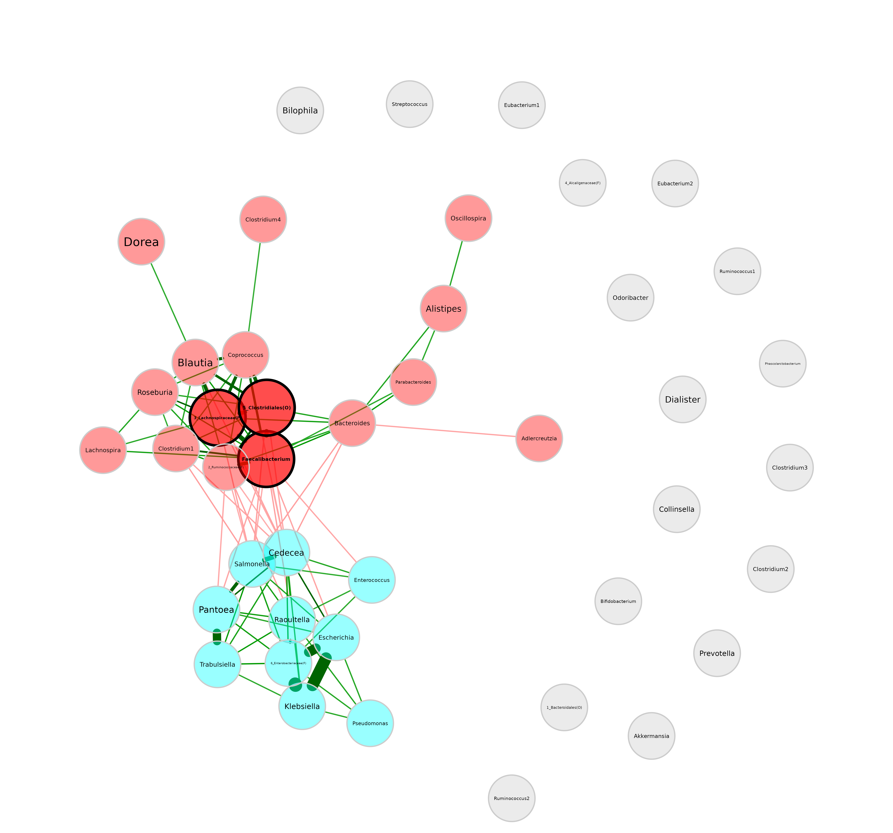
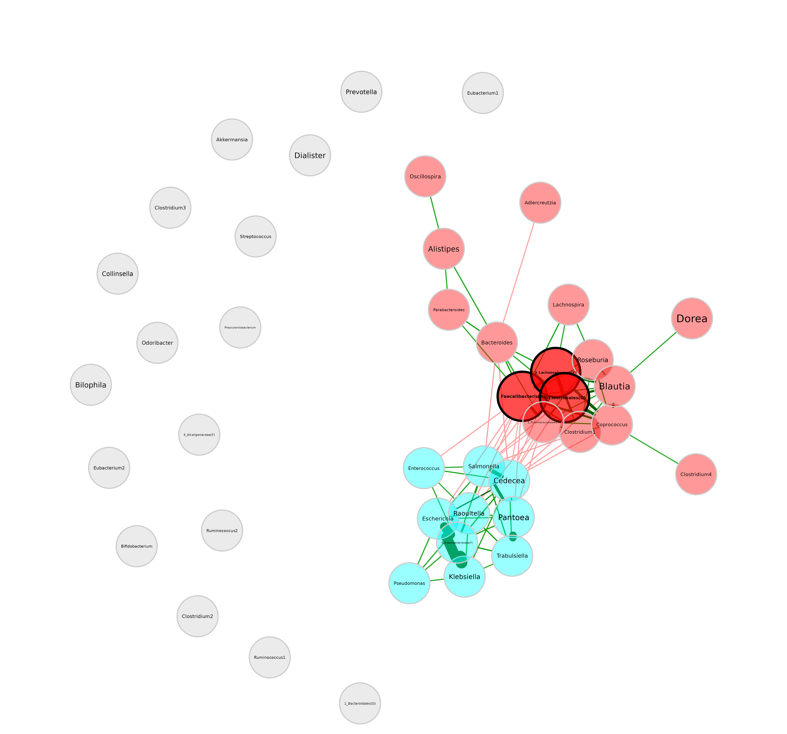
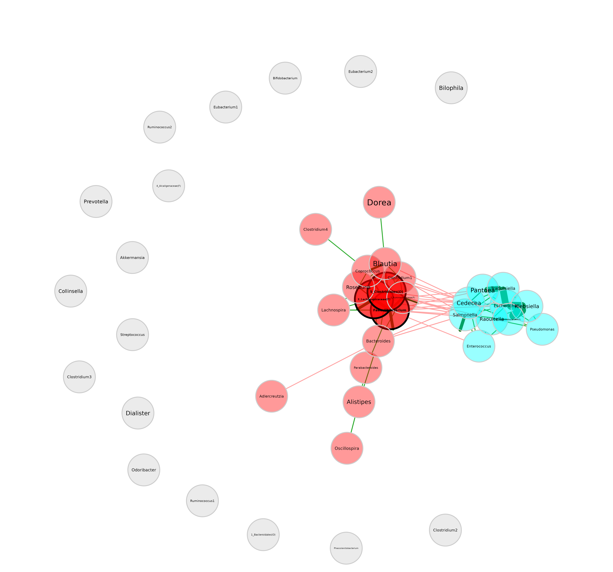
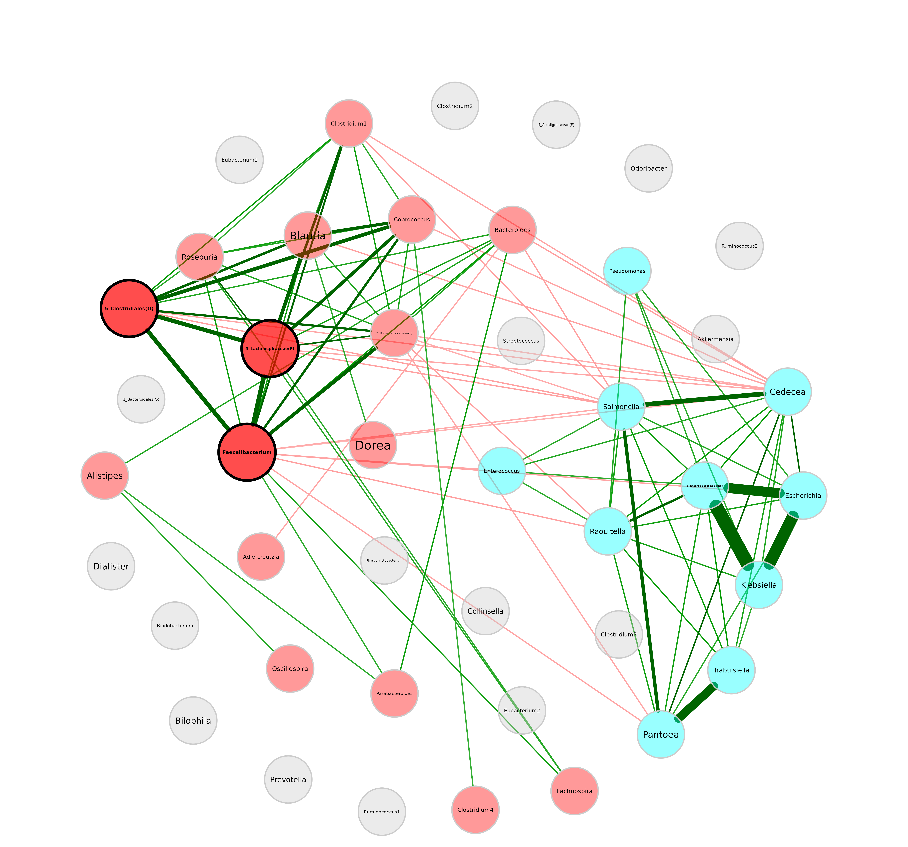
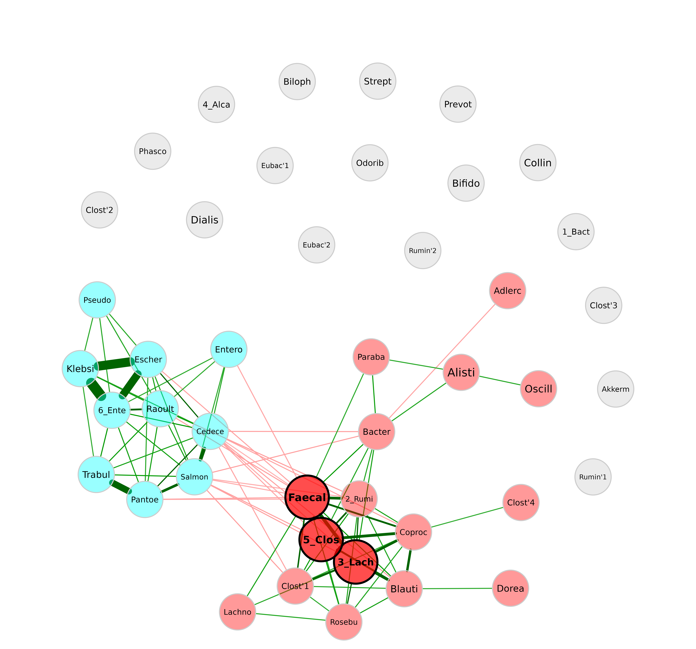
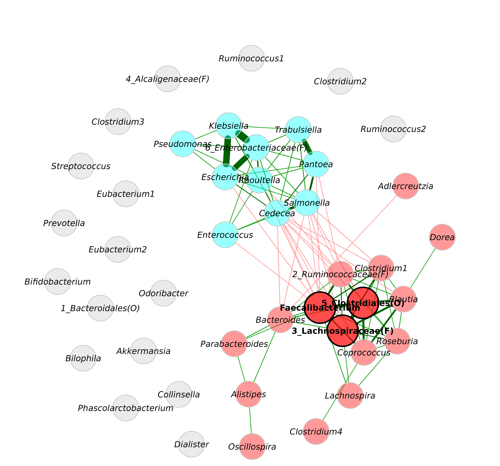

# Modifying the network plot

``` r

library(NetCoMi)
library(phyloseq)
```

We construct a network at genus level to demonstrate a variety of
modification options for the network plot. The SparCC package is used
here because the resulting graph is denser than conditional independence
graphs, which is preferable for this tutorial.

## Network construction and analysis

``` r

data("amgut2.filt.phy")

# Agglomerate to genus level
amgut_genus <- tax_glom(amgut2.filt.phy, taxrank = "Rank6")

# Rename taxonomic table and make Rank6 (genus) unique
amgut_genus_renamed <- renameTaxa(amgut_genus, 
                                  pat = "<name>", 
                                  substPat = "<name>_<subst_name>(<subst_R>)",
                                  numDupli = "Rank6")
#> Column 7 contains NAs only and is ignored.

# Network construction and analysis
net <- netConstruct(amgut_genus_renamed,
                    taxRank = "Rank6",
                    measure = "sparcc",
                    normMethod = "none", 
                    zeroMethod = "none",
                    sparsMethod = "thresh",
                    thresh = 0.3,
                    dissFunc = "signed",
                    verbose = 2,
                    seed = 123456)
#> Checking input arguments ...
#> Done.
#> 2 rows with zero sum removed.
#> 43 taxa and 294 samples remaining.
#> 
#> Calculate 'sparcc' associations ... Done.
#> 
#> Sparsify associations via 'threshold' ... Done.

netprops <- netAnalyze(net, 
                       clustMethod = "cluster_fast_greedy",
                       gcmHeat = FALSE # Do not plot the GCM heatmap
)
```

### Simple network plot

``` r

plot(netprops)
```



In the following we will look at different examples, where the arguments
of `plot.microNetProps` are adjusted.

### Layout

Circular layout:

``` r

plot(netprops, layout = "circle")
```


Layouts from `igraph`package are also accepted (see
[`?igraph::layout_`](https://r.igraph.org/reference/layout_.html)).

``` r

plot(netprops, layout = "layout_with_fr")
```



We can also use a layout in matrix form. Here, we generate one in
advance using the Fruchterman-Reingold layout algorithm from `igraph`
package.

``` r

# Compute layout
graph <- igraph::graph_from_adjacency_matrix(net$adjaMat1, 
                                             weighted = TRUE)
set.seed(123456)
lay_fr <- igraph::layout_with_fr(graph)

# Row names of the layout matrix must match the node names
rownames(lay_fr) <- rownames(net$adjaMat1)

plot(netprops, 
     layout = lay_fr)
```


We can see that the layout is basically the same as before, just
rotated.

### Repulsion

Nodes are placed closer together for smaller repulsion values and
further apart for higher values.

``` r

plot(netprops, repulsion = 1.2)
```



``` r

plot(netprops, repulsion = 0.5)
```



For the rest of the tutorial we will use a repulsion of 0.9.

### Shorten labels

``` r

plot(netprops, 
     repulsion = 0.9,
     shortenLabels = "simple", 
     labelLength = 6)
```


In many cases, it makes sense to use the ” intelligent ” label
shortening, which preserves the last part of the label. This allows you
to distinguish for instance between Enterococcus and Enterobacter. With
the following label pattern, they would be abbreviated to “Enter’coc”
and “Enter’bac”, while both would be abbreviated to “Entero” with the
“simple” shortening used before.

``` r

plot(netprops, 
     repulsion = 0.9,
     shortenLabels = "intelligent", 
     labelPattern = c(5, "'", 3, "'", 3))
```



### Label size and scaling

By default, labels are scaled according to node size.

``` r

plot(netprops, 
     repulsion = 0.9,
     labelScale = FALSE)
```


``` r

plot(netprops, 
     repulsion = 0.9,
     labelScale = FALSE,
     cexLabels = 1.5)
```


If the labels overlap, one can play around with the `repulsion` argument
to randomly rearrange the node placement until a good solution is found.

``` r

plot(netprops, 
     repulsion = 0.901,
     labelScale = FALSE,
     cexLabels = 1.5)
```


### Label font

Label fonts can be manipulated with the `labelFont` argument. 2 stands
for bold, 3 for italic, and so on. It is recommended to define the hub
label font separately.

``` r

plot(netprops, 
     repulsion = 0.901,
     labelScale = FALSE,
     cexLabels = 1.5,
     labelFont = 3,
     hubLabelFont  = 2)
```


